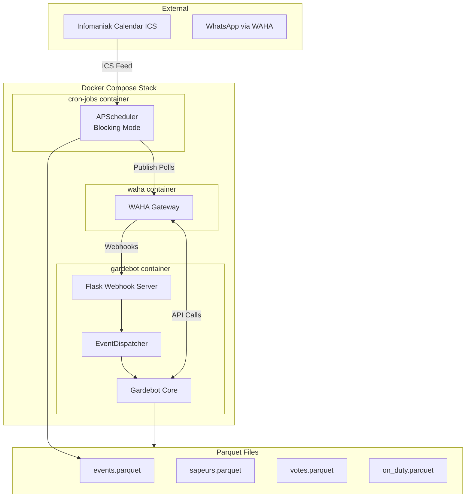
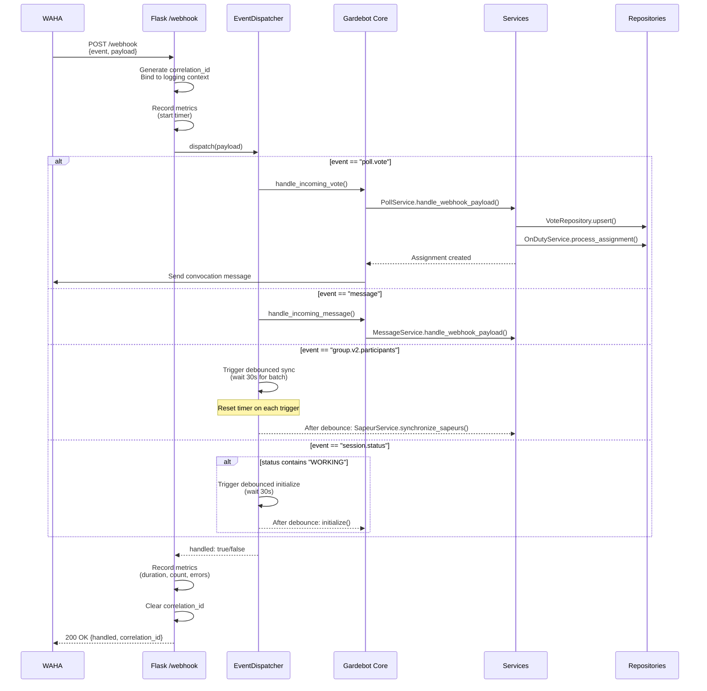
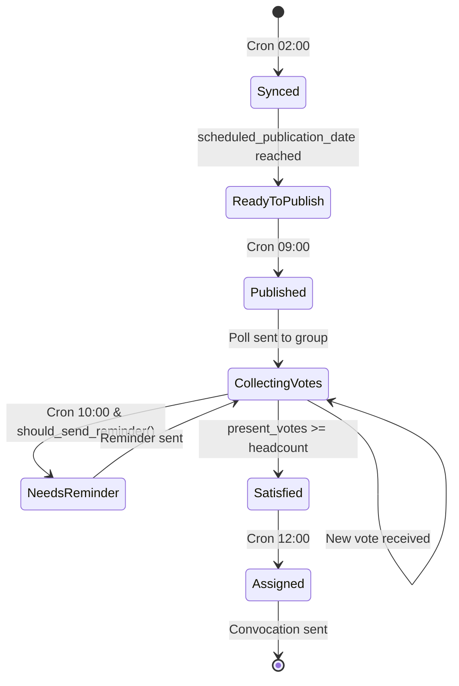
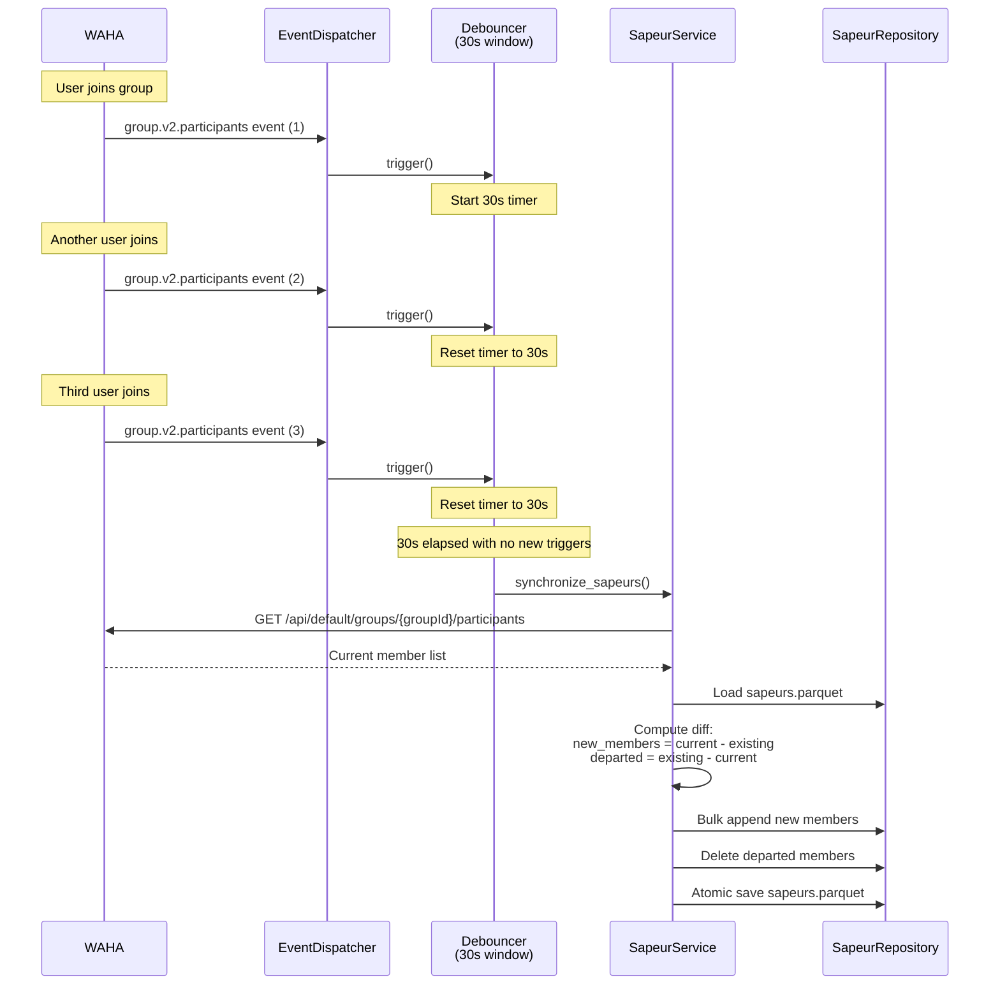
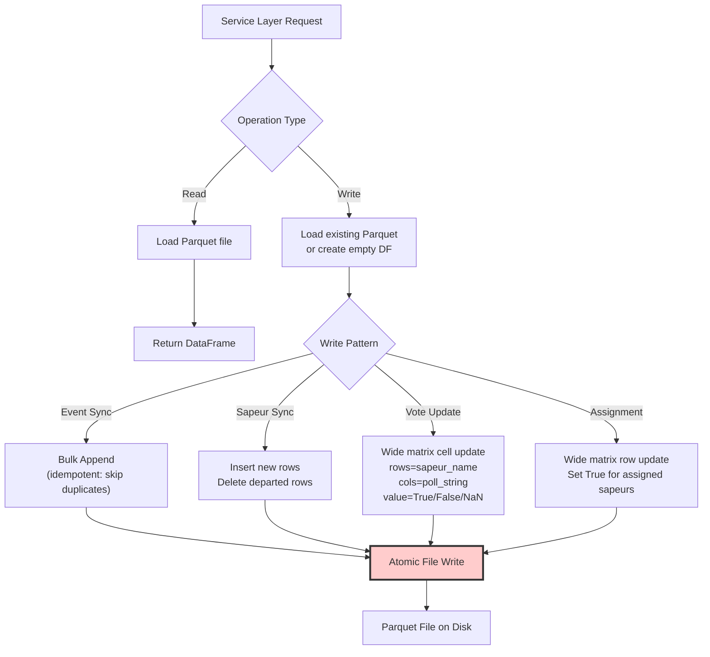

# Gardebot

Gardebot is a Python 3.11 WhatsApp automation service for duty ("garde") scheduling. It integrates with Infomaniak Calendar and WAHA (WhatsApp HTTP API) to manage availability polling, vote collection, and on-duty assignments for a WhatsApp group.

---

## Overview

Gardebot operates through three synchronized processes:

1. **Scheduled Jobs** (cron-jobs container) — Periodic tasks that sync events, publish polls, send assignments, and warn about holidays
2. **Webhook Processing** (gardebot container) — Real-time handling of WhatsApp events (messages, votes, group changes)
3. **Data Persistence** — Atomic Parquet file storage for events, participants, votes, and assignments

---

## Architecture

### System Components



### Request Flow: Webhook Processing



---

## Process Flows

### 1. Event Lifecycle: Calendar to Assignment

**State Transitions:**



**Process Detail:**

| Phase | Trigger | Actions | Data Changes |
|-------|---------|---------|--------------|
| **Sync** | Cron: 02:00 daily | 1. Fetch ICS from `CALENDAR_URL`<br/>2. Parse iCalendar events<br/>3. Filter: `start_date >= now()`<br/>4. Drop rows with NA values<br/>5. Suffix duplicate titles (e.g., "Garde", "Garde_1", "Garde_2")<br/>6. Bulk upsert to `events.parquet` | New events appended |
| **Ready to Publish** | `scheduled_publication_date <= now` | Event qualifies for poll creation | State flag change |
| **Publication** | Cron: 09:00 daily | 1. Query events where `scheduled_publication_date <= now` AND `is_assigned() == False`<br/>2. Create WhatsApp poll via WAHA API<br/>3. Store returned `poll_uid` in event record<br/>4. Set `published_date` to current timestamp | `event.poll_uid` set<br/>`event.published_date` set |
| **Vote Collection** | Webhook: `poll.vote` | 1. Extract voter ID from payload<br/>2. Resolve voter to Sapeur<br/>3. Parse vote option (Présent/Absent)<br/>4. Update `votes.parquet` matrix cell<br/>5. Check satisfaction: `present_count >= event.headcount` | Vote matrix cell updated |
| **Reminder** | Cron: 10:00 daily | 1. Check `event.should_send_reminder()` logic:<br/>&nbsp;&nbsp;- `published_date` is set<br/>&nbsp;&nbsp;- `nb_reminder < MAX_NB_REMINDER (3)`<br/>&nbsp;&nbsp;- Elapsed time >= `MINIMUM_ELAPSED_HOURS (23) * (nb_reminder + 1)`<br/>2. Send WhatsApp message with @mentions<br/>3. Increment `event.nb_reminder` | Reminder counter incremented |
| **Assignment** | Cron: 12:00 daily | 1. Iterate all events<br/>2. If `vote_service.test_event_completion(event)` AND NOT `is_assigned()`<br/>3. Create assignment with present sapeurs<br/>4. Send formatted convocation message | `on_duty.parquet` updated |

**Key Decision Points:**

- **Can publish?** `scheduled_publication_date <= now` AND `poll_uid is None` AND NOT `is_assigned()`
- **Is satisfied?** `present_vote_count >= event.headcount`
- **Should remind?** `published_date is set` AND `nb_reminder < 3` AND `elapsed_hours >= 23 * (nb_reminder + 1)`

**Reminder Timing Example:**
- 1st reminder: 23 hours after publication (`nb_reminder = 0`, wait = 23h)
- 2nd reminder: 46 hours after publication (`nb_reminder = 1`, wait = 46h)
- 3rd reminder: 69 hours after publication (`nb_reminder = 2`, wait = 69h)
- Max 3 reminders total

### 2. Participant Synchronization with Debouncing



**Purpose:** When multiple members join/leave in quick succession (e.g., during group creation or bulk changes), debouncing consolidates all changes into a single synchronization operation, reducing API calls and repository writes.

### 3. Data Persistence Architecture



**File Schemas:**

| File | Columns | Row Key | Update Pattern |
|------|---------|---------|----------------|
| **events.parquet** | `title`, `start_date`, `end_date`, `location`, `headcount`, `poll_string`, `poll_uid`, `scheduled_publication_date`, `published_date`, `nb_reminder` | `poll_string` | Append-only (new events) |
| **sapeurs.parquet** | `uid`, `name`, `phone`, `pushname`, `joined_date`, `group_id` | `uid` | Insert new + delete departed |
| **votes.parquet** | `index` (sapeur_name), `poll_string_1`, `poll_string_2`, ... | `index` | Cell update: `True`=Présent, `False`=Absent, `NaN`=no vote |
| **on_duty.parquet** | `index` (sapeur_name), `poll_string_1`, `poll_string_2`, ... | `index` | Cell update: `True`=assigned, `False`=not assigned |

**Atomicity:** Each write loads the entire file into memory (pandas DataFrame), applies modifications, then performs atomic file replacement via `df.to_parquet()`. Safe for single-instance deployment; concurrent access requires database migration.

---

## Code Organization

### Complete Module Structure

```
src/gardebot/
├── adapters/                      # WAHA API high-level abstractions
│   ├── __init__.py
│   ├── contacts.py                # Contact resolution (ID → Sapeur)
│   ├── groups.py                  # Group participant retrieval
│   ├── messaging.py               # Text message and mention sending
│   └── polling.py                 # Poll creation and vote parsing
│
├── common/                        # Cross-cutting utilities
│   ├── __init__.py
│   ├── common.py                  # Secret loading, formatting helpers
│   ├── debounce.py                # Debouncer class with threading timer
│   ├── logging_configuration.py  # Structlog setup, correlation ID binding
│   └── storage.py                 # Parquet file path resolution, atomic write helpers
│
├── http/                          # Resilient HTTP client layer
│   ├── __init__.py
│   └── http_client.py             # Retry logic, exponential backoff, jitter, error wrapping
│
├── integrations/                  # External service clients
│   ├── __init__.py
│   ├── infomaniak.py              # ICS calendar fetching and parsing
│   └── waha_client.py             # Low-level WAHA API wrapper using HttpClient
│
├── models/                        # Pydantic domain models
│   ├── __init__.py
│   ├── domain.py                  # Event, Sapeur, VoteRecord, OnDutyAssignment, ParticipationScore
│   └── message_event.py           # MessageEventEnvelope (typed webhook payload)
│
├── services/                      # Business logic orchestration
│   ├── __init__.py
│   ├── events.py                  # EventService: calendar sync, event queries, reminder increments
│   ├── group_service.py           # GroupService: group participant operations
│   ├── message_service.py         # MessageService: convocation, reminders, admin notifications
│   ├── onduty.py                  # OnDutyService: assignment creation, satisfaction checks
│   ├── poll_service.py            # PollService: poll publication, vote webhook handling
│   ├── sapeur.py                  # SapeurService: roster synchronization
│   └── votes.py                   # VoteService: vote matrix operations, completion checks
│
├── app.py                         # Flask application factory
├── config.py                      # Application-level constants (TIME_BEFORE_PUBLICATION_DAY=21, PREVENTION_DAY_BEFORE_HOLIDAY=35, MAX_NB_REMINDER=3, MINIMUM_ELAPSED_HOURS=23)
├── dispatcher.py                  # EventDispatcher: webhook routing, debounce orchestration
├── error_handlers.py              # Flask error handlers (404, 500, etc.)
├── errors.py                      # Custom exceptions (NotFoundError, ValidationError, etc.)
├── gardebot.py                    # Gardebot class: composition root, entry point handlers
├── main.py                        # CLI entry point (unused in Docker deployment)
├── metrics.py                     # Prometheus metric definitions
├── repositories.py                # Parquet persistence layer (EventRepo, SapeurRepo, VoteRepo, OnDutyRepo)
├── scheduler.py                   # APScheduler cron job definitions
├── settings.py                    # Pydantic settings models (env var loading)
└── validation.py                  # Webhook payload validation
```

### Module Responsibilities

#### adapters/
High-level WAHA interaction wrappers that abstract API details:

- **contacts.py** — `ContactAdapter.get_contact_by_id()`: Resolves WhatsApp contact ID to Sapeur object
- **groups.py** — `GroupAdapter.get_participants()`: Fetches group member list from WAHA
- **messaging.py** — `MessagingAdapter.send_text()`, `.send_message_with_mentions()`: WhatsApp text/mention messages
- **polling.py** — `PollingAdapter.create_poll()`, `.parse_vote_event()`: Poll creation and vote extraction

#### common/
Utilities shared across the application:

- **common.py** — `load_secret()`, `format_phone_number()`, `_format_french_date()`: Date formatting helpers with French locale (e.g., "lundi 15 janvier 2025")
- **debounce.py** — `Debouncer` class: Implements timer-based debouncing with thread safety using `threading.Timer`
- **logging_configuration.py** — Configures structlog with correlation ID context binding, JSON/console output, timezone handling
- **storage.py** — `get_storage_path()`: Resolves Parquet file paths, atomic file write helpers

#### http/
Resilient HTTP client with production-grade reliability:

- **http_client.py** — `HttpClient`: Implements exponential backoff with jitter, configurable retries (default: 3), timeout handling, structured error wrapping with `HttpError`

#### integrations/
External service clients:

- **infomaniak.py** — `InfomaniakClient.fetch_events()`: Downloads ICS feed via HTTP, parses iCalendar format using `icalendar` library, converts `VEVENT` components to Event domain models
- **waha_client.py** — `WahaClient`: Low-level WAHA API wrapper (POST/GET methods, session management, API key injection via headers)

#### models/
Pydantic domain models with validation:

- **domain.py**:
  - `Event`: Event with `should_send_reminder()`, `is_published()`, `increment_reminder()`, `set_published_date()`, `with_poll_uid()` methods
  - `Sapeur`: Participant with WhatsApp identifiers (`uid`, `name`, `phone`, `pushname`, `joined_date`, `group_id`)
  - `VoteRecord`: Vote entry linking sapeur, event, and choice (True/False/None)
  - `OnDutyAssignment`: Assignment container with event and sapeur list
  - `ParticipationScore`: Scoring model for fairness (roadmap feature)
- **message_event.py** — `MessageEventEnvelope`: Typed structure for `message` webhook events with Pydantic validation

#### services/
Business logic orchestration layer:

- **events.py** — `EventService`: Calendar synchronization via InfomaniakClient, event filtering (future events only), reminder counter increments (`increment_reminder()`)
- **group_service.py** — `GroupService`: Group participant operations via GroupAdapter, member list retrieval
- **message_service.py** — `MessageService`: Convocation formatting (French date/time), reminder generation with @mentions, admin notifications for holidays
- **onduty.py** — `OnDutyService`: Assignment creation from satisfied events, satisfaction testing (`is_assigned()`), nomination scoring for fairness (future)
- **poll_service.py** — `PollService`: Poll publication scheduling (`publish_polls()`), vote webhook processing, poll UID tracking
- **sapeur.py** — `SapeurService`: Roster synchronization (`synchronize_sapeurs()`): insert new members, delete departed
- **votes.py** — `VoteService`: Vote matrix CRUD operations, completion testing (`test_event_completion()`: `present_count >= headcount`)

#### Core Files

- **app.py** — Flask factory: `/webhook` (POST), `/health` (GET), `/metrics` (GET) endpoints, correlation ID middleware, before/after request hooks, error handlers registration
- **dispatcher.py** — `EventDispatcher`: Maps webhook events to handlers (`message`, `poll.vote`, `session.status`, `group.v2.participants`), manages two debouncers (initialization: 30s, participant sync: 30s)
- **gardebot.py** — `Gardebot`: Composition root instantiating all services, providing entry point methods (`initialize()`, `handle_incoming_vote()`, `handle_incoming_message()`, `assign_on_duty_for_events()`, `reminders()`, `send_holiday_warning()`)
- **repositories.py** — Parquet persistence: `EventRepository` (bulk upsert), `SapeurRepository` (insert+delete), `VoteRepository` (wide matrix cell updates), `OnDutyRepository` (assignment matrix)
- **scheduler.py** — APScheduler job definitions running in blocking mode with timezone `Europe/Zurich`
- **settings.py** — Pydantic settings: `ServerSettings` (host, port, debug, postpone_sync_time), `ApiSettings` (WAHA base URL, session), `LoggingSettings` (level, JSON), `RetrySettings` (max retries, backoff)

---

## Scheduled Jobs (cron-jobs container)

The scheduler container runs five periodic tasks in `Europe/Zurich` timezone:

```python
scheduler.add_job(sync_events,        "cron", hour=2)   # 02:00 AM
scheduler.add_job(publish_polls,      "cron", hour=9)   # 09:00 AM
scheduler.add_job(send_reminders,     "cron", hour=10)  # 10:00 AM
scheduler.add_job(send_assignments,   "cron", hour=12)  # 12:00 PM
scheduler.add_job(warn_holidays,      "cron", hour=12)  # 12:00 PM
```

### Task Details

| Time | Function | Process | Data Updated |
|------|----------|---------|--------------|
| **02:00** | `sync_events()` | 1. Fetch ICS from `CALENDAR_URL`<br/>2. Parse iCalendar format<br/>3. Filter `start_date >= now`<br/>4. Drop NA rows, suffix duplicates<br/>5. Bulk upsert to `events.parquet` | `events.parquet` |
| **09:00** | `publish_polls()` | 1. Query events: `scheduled_publication_date <= now` AND NOT `is_assigned()`<br/>2. Create poll via WAHA API<br/>3. Store `poll_uid` and `published_date` in event | `events.parquet` (`poll_uid`, `published_date` fields) |
| **10:00** | `send_reminders()` | 1. For each event: check `should_send_reminder()`<br/>2. Send message with @mentions to non-voters<br/>3. Increment `event.nb_reminder` | `events.parquet` (`nb_reminder` field) |
| **12:00** | `send_assignments()` | 1. For each event: test `vote_service.test_event_completion()`<br/>2. If satisfied AND NOT assigned: create assignment<br/>3. Send convocation message | `on_duty.parquet` |
| **12:00** | `warn_holidays()` | 1. Load Swiss (Geneva) holidays for current + next year<br/>2. Filter `days_until == PREVENTION_DAY_BEFORE_HOLIDAY (35)`<br/>3. Send admin notification via SMS/WhatsApp | (none) |

---

## Domain Models

### Event

```python
class Event(BaseModel):
    title: str
    start_date: pd.Timestamp
    end_date: pd.Timestamp
    location: str
    headcount: int
    poll_string: str                       # Computed: "Title : DD month YYYY HHhMM au DD month YYYY HHhMM, Location"
    poll_uid: Optional[str] = None
    published_date: Optional[pd.Timestamp] = None
    scheduled_publication_date: pd.Timestamp  # Computed: start_date - 21 days
    nb_reminder: int = 0
    
    def should_send_reminder(self) -> bool:
        """
        Reminder timing logic:
        - Must be published (published_date is set)
        - Must not exceed MAX_NB_REMINDER (3)
        - Elapsed time >= MINIMUM_ELAPSED_HOURS (23) * (nb_reminder + 1)
        
        Examples:
        - 1st reminder: 23h after publication (nb_reminder=0)
        - 2nd reminder: 46h after publication (nb_reminder=1)
        - 3rd reminder: 69h after publication (nb_reminder=2)
        """
    
    def is_assigned(self) -> bool:
        """Check if on_duty.parquet contains assignment for this poll_string."""
    
    def is_published(self) -> bool:
        """Check if event has published_date and poll_uid set."""
```

**poll_string** acts as the composite logical key linking events, votes, and assignments across repositories.

### Sapeur

```python
class Sapeur(BaseModel):
    uid: str              # WhatsApp contact ID (e.g., "41791234567@c.us")
    name: str             # Display name
    phone: str            # Phone number (international format)
    pushname: str         # WhatsApp push name
    joined_date: pd.Timestamp
    group_id: str         # WhatsApp group ID
```

### VoteRecord

```python
class VoteRecord(BaseModel):
    sapeur: Sapeur
    event: Event
    value: Optional[bool]  # True=Présent, False=Absent, None=no vote
```

### OnDutyAssignment

```python
class OnDutyAssignment(BaseModel):
    event: Event
    sapeur_list: List[Sapeur]
    assigned: bool = True
```

### Wide Matrix Storage

**votes.parquet example:**
```
index (sapeur_name)  | poll_string_1 | poll_string_2 | poll_string_3
---------------------|---------------|---------------|---------------
Alice Dupont         | True          | NaN           | False
Bob Martin           | True          | True          | NaN
Claire Bernard       | False         | True          | True
```

- `True` = Présent
- `False` = Absent
- `NaN` = No response yet

**on_duty.parquet example:**
```
index (sapeur_name)  | poll_string_1 | poll_string_2 | poll_string_3
---------------------|---------------|---------------|---------------
Alice Dupont         | True          | False         | False
Bob Martin           | True          | False         | False
Claire Bernard       | False         | True          | True
```

---

## Configuration

### Environment Variables

**Server Configuration:**
```bash
SERVER_HOST=0.0.0.0              # Flask bind address
SERVER_PORT=5000                 # Flask port
SERVER_DEBUG=false               # Debug mode
POSTPONE_SYNC_TIME=30            # Debounce window (seconds)
```

**WAHA Integration:**
```bash
WAHA_BASE_URL=http://waha:3000   # WAHA API base URL
WAHA_SESSION=default             # WAHA session name
API_KEY=<secret>                 # WAHA API authentication key
```

**Calendar Integration:**
```bash
CALENDAR_URL=<secret>            # Infomaniak ICS endpoint
```

**Logging:**
```bash
LOG_LEVEL=INFO                   # DEBUG, INFO, WARNING, ERROR
LOG_JSON=false                   # Enable JSON logging for production
```

**Notifications:**
```bash
ADMIN_NUMBER=<secret>            # Phone number for admin notifications (e.g., +41791234567)
```

### Application Constants (config.py)

```python
TIME_BEFORE_PUBLICATION_DAY = 21        # Days before event to publish poll
PREVENTION_DAY_BEFORE_HOLIDAY = 35      # Days ahead to warn about holidays
MAX_NB_REMINDER = 3                     # Maximum number of reminders per event
MINIMUM_ELAPSED_HOURS = 23              # Hours between reminders
MARGIN_NOMINATION = 2                   # Margin for forced nomination (future)
```

### Secret Management

Secrets loaded via **Doppler** (production) or `.env` file (development):

```env
# credentials.env
API_KEY=waha_api_key_here
CALENDAR_URL=https://calendar.infomaniak.com/...
ADMIN_NUMBER=+41791234567
```

Doppler CLI auto-injects secrets into container environment.

---

## Observability

### Prometheus Metrics

**Endpoint:** `http://localhost:5000/metrics`

| Metric | Type | Labels | Description |
|--------|------|--------|-------------|
| `gardebot_webhook_events_total` | Counter | `event`, `handled` | Total webhook events received (e.g., event="poll.vote", handled="true") |
| `gardebot_webhook_errors_total` | Counter | `event`, `code` | Errors by event type and HTTP/exception code |
| `gardebot_webhook_latency_seconds` | Histogram | `event` | Processing duration distribution |
| `gardebot_participant_sync_total` | Counter | — | Count of debounced roster synchronizations |
| `gardebot_initialize_total` | Counter | — | Full initialization executions |
| `gardebot_poll_publish_total` | Counter | `status` | Poll publication attempts (status="success"/"failure") |
| `gardebot_vote_processed_total` | Counter | `result` | Vote processing outcomes (result="success"/"error") |

### Correlation IDs

Each webhook request generates a UUID correlation ID bound to the logging context:

1. **Generation:** `correlation_id = str(uuid.uuid4())` at request start
2. **Binding:** `structlog.contextvars.bind_contextvars(correlation_id=correlation_id)`
3. **Propagation:** Included in all log entries for that request
4. **Response:** Returned in webhook JSON response
5. **Cleanup:** `structlog.contextvars.clear_contextvars()` at request end

**Example log entry:**
```json
{
  "event": "poll.vote",
  "correlation_id": "a1b2c3d4-5e6f-7g8h-9i0j-k1l2m3n4o5p6",
  "poll_string": "Garde : lundi 15 janvier 2025 08h00 au mardi 16 janvier 2025 08h00, Caserne",
  "voter": "Alice Dupont",
  "vote": "Présent",
  "timestamp": "2025-01-10T09:15:23.456Z",
  "level": "info"
}
```

### Health Check

**Endpoint:** `http://localhost:5000/health`

**Response:**
```json
{
  "status": "healthy",
  "timestamp": "2025-01-10T12:00:00.000Z"
}
```

**Docker Healthcheck:**
```dockerfile
HEALTHCHECK --interval=30s --timeout=3s --start-period=10s --retries=3 \
  CMD wget -qO- http://localhost:5000/health || exit 1
```

Runs every 30 seconds; container marked unhealthy after 3 consecutive failures.

---

## Deployment

### Docker Compose

**Architecture:**
```yaml
services:
  waha:          # WhatsApp HTTP API gateway (port 3000)
  gardebot:      # Flask webhook server (port 5000)
  cron-jobs:     # APScheduler daemon (no exposed ports)
```

**Network:**
- Internal bridge network for inter-container communication
- External ports: 3000 (WAHA), 5000 (Gardebot)

**Startup:**
```bash
# Build and start all containers
docker compose up --build

# Detached mode (production)
docker compose up -d

# View logs
docker compose logs -f gardebot
docker compose logs -f cron-jobs
```

**Volumes:**
- `./.sessions:/app/.sessions` — WAHA session persistence (QR code authentication)
- Parquet files stored in container filesystem at `/app/.gardebot_data/` (consider external volume for production)

### Local Development

```bash
# Install dependencies
poetry install

# Activate virtual environment
poetry shell

# Run webhook server (terminal 1)
export WAHA_BASE_URL=http://localhost:3000
export API_KEY=your_api_key
export CALENDAR_URL=your_calendar_url
python -m gardebot.app

# Run scheduler (terminal 2)
python -m gardebot.scheduler
```

**Prerequisites:**
- Python 3.11
- Poetry 1.8.4+
- WAHA instance running (local or remote)

---

## Testing Strategy

| Component | Test Focus | Tools |
|-----------|------------|-------|
| **Webhooks** | Valid/invalid JSON payloads, correlation ID presence, metric recording | pytest, Flask test client |
| **Dispatcher** | Exact event matching, debounce timing (time mocks), unhandled events | pytest, unittest.mock |
| **Repositories** | Upsert idempotency, `NotFoundError` conditions, matrix cell updates | pytest, pandas testing |
| **Event Service** | Duplicate name suffixing, NA filtering, future-only filtering | pytest |
| **Poll Service** | Publication guards (not due/already assigned), poll UID tracking | pytest, mock WAHA client |
| **Vote Service** | Matrix updates, invalid vote rejection, satisfaction logic | pytest |
| **Sapeur Service** | Bulk insert/delete, debounced sync behavior | pytest, time mocks |
| **HTTP Client** | Retry/backoff logic, jitter randomization, error propagation | pytest, responses library |
| **Assignment** | Satisfaction conditions, convocation formatting | pytest |
| **Reminder Logic** | Elapsed time calculation, reminder counter limits | pytest, time mocks |

**Run tests:**
```bash
poetry run pytest tests/ -v --cov=gardebot
```

---

## Troubleshooting

| Symptom | Diagnosis | Solution |
|---------|-----------|----------|
| **No events loaded** | `CALENDAR_URL` missing/invalid | Verify secret in Doppler/env, check ICS endpoint with curl |
| **Poll not published** | Not due OR already assigned | Check `event.scheduled_publication_date <= now` and `event.is_assigned()` in logs |
| **Votes ignored** | Headcount already satisfied | Verify assignment state in `on_duty.parquet`, check `present_count < headcount` |
| **Stale roster** | Debounce too long OR missed sync | Lower `POSTPONE_SYNC_TIME`, trigger manual `initialize()` via session status |
| **Missing metrics** | Prometheus scrape config OR endpoint unreachable | `curl http://localhost:5000/metrics`, verify Prometheus `scrape_configs` |
| **Duplicate holiday warnings** | `PREVENTION_DAY_BEFORE_HOLIDAY` logic error | Check config value (35 days), verify date calculation in logs |
| **WAHA session disconnected** | QR code expired | Access WAHA UI at `http://localhost:3000`, re-scan QR code |
| **Correlation ID leakage** | Context not cleared | Check `app.py` after-request handler, ensure `clear_contextvars()` is called |
| **Reminders not sent** | Timing conditions not met | Check `should_send_reminder()`: published_date set, nb_reminder < 3, elapsed >= 23*(nb_reminder+1) hours |

**Debug mode:**
```bash
# Enable debug logging
export LOG_LEVEL=DEBUG
export LOG_JSON=false

# Restart container
docker compose restart gardebot
docker compose logs -f gardebot
```

---

## Design Principles

1. **Separation of Concerns** — Clear layering: Adapters → Services → Repositories → Models
2. **Deterministic State** — Atomic Parquet writes (planned evolution to transactional DB)
3. **Observability First** — Metrics, correlation IDs, structured logging from day one
4. **Minimal Coupling** — Poll publication independent of vote handling; assignment logic separate from reminder scheduling
5. **Debounce Noisy Events** — Batch participant changes to reduce API calls and repository churn
6. **Type Safety** — Pydantic models enforce schema validation at boundaries
7. **Resilient HTTP** — Exponential backoff with jitter for external API calls

---

## License

See `LICENSE` file.

---

## Acknowledgements

- [WAHA](https://waha.devlike.pro/) — WhatsApp HTTP API gateway
- [Infomaniak](https://www.infomaniak.com/) — Calendar hosting and Kdrive storage
- [Doppler](https://www.doppler.com/) — Secrets management
- Python OSS community (pandas, pydantic, flask, structlog, prometheus-client)

---

**Built with structured logging, typed domain models, and resilient HTTP abstractions.** 🚀
