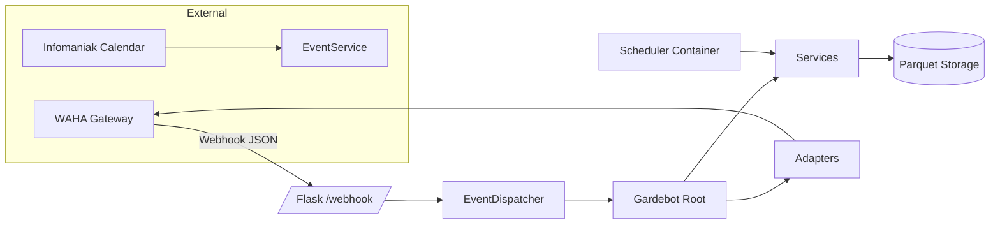
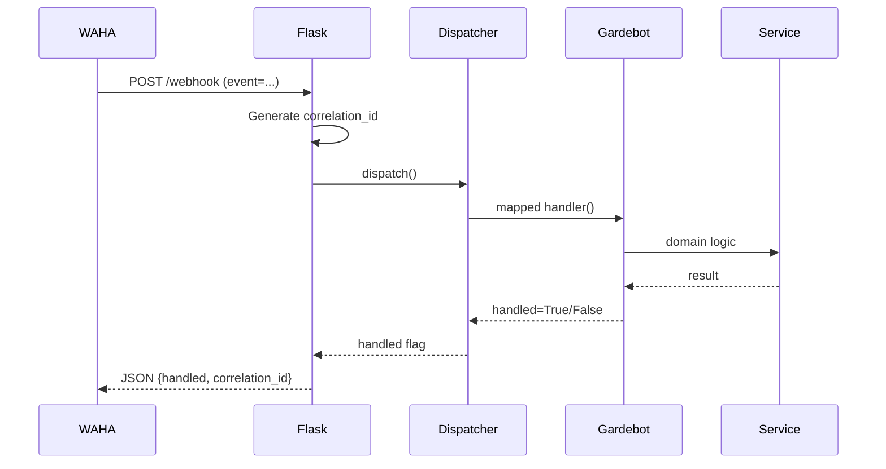
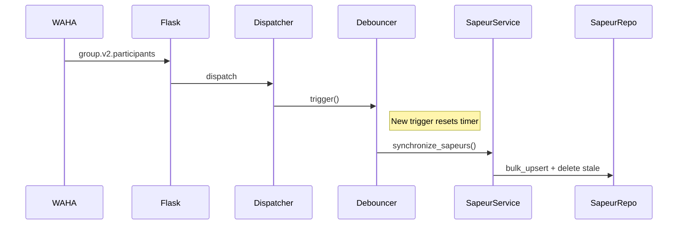

# Gardebot

Gardebot is a Python 3.11 WhatsApp automation service that turns duty (“garde”) scheduling into a semi‑automated workflow:

- Imports upcoming duty events from an Infomaniak Calendar (ICS).
- Publishes availability polls to a WhatsApp group via WAHA (WhatsApp HTTP API).
- Collects and stores votes (Présent / Absent).
- Tracks roster participation and on‑duty assignment saturation (headcount reached).
- Issues holiday warnings and (future) reminders / escalations.

It is designed as a clean composition root with explicit layers, typed models (Pydantic), structured logging (correlation IDs), metrics (Prometheus), and deterministic persistence (atomic Parquet writes, roadmap to DB).

---

## 1. High-Level Architecture



### Webhook Flow



### Debounced Participant Sync



---

## 2. Folder Glossary (src/gardebot)

| Path | Purpose |
|------|---------|
| adapters | Translate domain actions to WAHA HTTP calls (polling, messaging, groups, contacts). |
| common | Cross-cutting utilities: logging config, debounce, storage helpers, secrets, formatting. |
| http | Resilient HTTP client (retry, exponential backoff + jitter, structured errors). |
| integrations | External system interfaces (Infomaniak calendar parsing; WAHA client wrapper). |
| models | Pydantic domain entities & validation (Event, Sapeur, VoteRecord, OnDutyAssignment, MessageEventEnvelope, scoring). |
| services | Business orchestration (events sync, votes, on-duty assignment, roster sync, messaging, nomination logic). |
| app.py | Flask app factory (webhook /health /metrics) + correlation IDs + metrics emission. |
| dispatcher.py | Exact event → handler mapping + debounced initialization / roster sync. |
| gardebot.py | Composition root wiring adapters + services; public handlers (initialize, process_vote, holidays). |
| repositories.py | Atomic Parquet persistence for events, sapeurs, votes, on-duty status (raising `NotFoundError` on misses). |
| scheduler.py | APScheduler cron jobs (event sync, poll publication, holiday warning). |
| settings.py | Typed configuration & secret loading (server, API, logging, retry/backoff). |
| validation.py | Message event validation & minimal shape checks for other events. |

---

## 3. Core Domain Concepts

| Concept | Description |
|---------|-------------|
| Event | A future duty slot with title, dates, location, headcount, poll metadata, publication schedule, reminder counters. |
| Poll String | Generated French human-readable identifier combining title, formatted dates, location (used as primary key in matrices). |
| Sapeur | Participant (name, uid, phone, joined date). |
| Vote | Availability response: Présent / Absent / None (no response yet). |
| On-Duty Assignment | Set of sapeurs marked as assigned once headcount satisfied. |
| Nomination (future) | Fair fallback selection among non-responders or absents using participation metrics. |

---

## 4. Event Lifecycle

1. Calendar sync (scheduler or manual initialize):
   - Fetch ICS events (future-only).
   - Clean (drop NA rows, suffix duplicates chronologically).
   - Bulk upsert new events; existing untouched.
2. Poll publication (09:00 job):
   - For due events (`scheduled_publication_date <= today`, not yet published/assigned).
   - Send WAHA poll (“Présent”, “Absent”).
   - Persist poll UID & published timestamp.
3. Vote ingestion:
   - Webhook `poll.vote` → parse sender → map selected option.
   - Store boolean (Présent=True, Absent=False, None=unset) in wide matrix.
4. Assignment (current minimal logic):
   - Satisfaction = count(Présent) >= headcount (read-only decision).
   - Future: separate step to nominate / assign explicitly.
5. Reminder (scaffolded):
   - Event tracks number of reminders & elapsed time since publication.
   - Logic available; cron currently disabled (roadmap reactivation).

---

## 5. Persistence (Parquet Wide Matrices)

| File | Shape | Key Columns | Notes |
|------|-------|-------------|-------|
| events.parquet | Rows=events | uid, poll_string | Idempotent bulk upsert (only adds new). |
| sapeurs.parquet | Rows=sapeurs | uid, name | Sync: bulk add + delete stale. |
| votes.parquet | Index=sapeur names; columns=poll_string | cell=True/False/NaN | NaN = no response yet. |
| on_duty.parquet | Index=sapeur names; columns=poll_string | cell=True/False | True marks assignment presence. |

Atomic whole-file rewrite; race conditions minimal in single-process usage (roadmap DB backend for concurrency).

---

## 6. Configuration & Secrets

- Env-driven via Pydantic models (`settings`).
- WAHA API key loaded lazily from secret management.
- Debounce interval configurable (`POSTPONE_SYNC_TIME`).
- Logging toggles: JSON, color, timestamps.
- Secrets (API keys, calendar URL) injected through Doppler / env files.

---

## 7. Observability

| Metric | Type | Labels | Meaning |
|--------|------|--------|---------|
| gardebot_webhook_events_total | Counter | event, handled | Inbound events processed. |
| gardebot_webhook_errors_total | Counter | event, code | Sanitized errors. |
| gardebot_webhook_latency_seconds | Histogram | event | Processing latency. |
| gardebot_participant_sync_total | Counter | - | Debounced roster sync executions. |
| gardebot_initialize_total | Counter | - | Full initialization runs. |
| gardebot_poll_publish_total | Counter | status | Success/failure of poll publication. |
| gardebot_vote_processed_total | Counter | result | Vote parsing success/error. |

Correlation ID (UUID) bound per request for log tracing and returned in webhook responses.

---

## 8. Scheduler (cron-jobs container)

| Job | Time (Europe/Zurich) | Action |
|-----|----------------------|--------|
| sync_events | 02:00 | Refresh events from calendar. |
| publish_polls | 09:00 | Publish due polls. |
| warn_holidays | 12:00 | Notify admin day-before holidays. |

Roadmap: re-enable reminders & escalation workflows, analytic rollups.

---

## 9. Extending Gardebot

| Task | Steps |
|------|-------|
| Add new event type | Define envelope model → map in `dispatcher._handlers` → implement handler → metrics instrumentation. |
| Add scheduler task | Create function in `scheduler.py` → register cron expression → instrument counters/histograms. |
| Change persistence backend | Introduce repository interface → implement DB variant → migrate bulk operations to row-wise transactions. |
| Add reminder workflow | Activate cron function → evaluate `Event.should_send_reminder()` → send targeted mention messages (messaging adapter). |
| Localization | Externalize French strings (poll options, messages) to resource files; inject via settings. |
| Assignment fairness | Introduce scoring (NominationService) → store rotation metadata → decouple poll publication from assignment decision. |

---

## 10. Testing Strategy

| Area | Focus |
|------|-------|
| Webhook | JSON validation, correlation ID, latency metric emission. |
| Dispatcher | Exact match, unhandled event path, debounce behavior (time mocking). |
| Repositories | Upsert semantics, `NotFoundError`, headcount satisfaction logic. |
| Calendar | Duplicate naming suffix, NA row removal, future filter correctness. |
| Polling | Publication guard conditions (already assigned / not due). |
| Votes | Acceptance of Présent / Absent / None; rejection of invalid values. |
| Sapeur Sync | Insert + deletion after membership change simulation. |
| Nomination | Score calculation, margin & penalty logic (non-responding vs absent). |
| HTTP Client | Retry & backoff composition, error surfacing. |
| Logging | Correlation scoping (cleared after request). |

---

## 11. Roadmap

1. Typed envelopes for all event types (reduce generic dict operations).
2. Database-backed persistence (transactional, row-level updates, concurrency).
3. Automated reminders + escalation (late vote nudges before assignment).
4. Fair rotation & workload analytics endpoint (participation heatmap).
5. Localization & multi-language duty poll strings.
6. Decoupled assignment workflow + administrative override interface.
7. Incremental calendar diff ingestion (avoid full reload).
8. Security hardening (request signature verification / auth gating).
9. Portfolio enhancements (deployment scripts, architectural diagrams repository).

---

## 12. Getting Started

```bash
# Install dependencies (Poetry + make targets)
make           # optional helper target
poetry install
poetry run python -m gardebot.app  # start Flask locally

# Docker workflow
docker compose up --build
# Containers:
# - waha        (WhatsApp API gateway)
# - gardebot    (Flask webhook + core services)
# - cron-jobs   (Scheduler tasks)
```

Environment essentials:
- `API_KEY` (WAHA)
- `CALENDAR_URL` (Infomaniak ICS)
- `ADMIN_NUMBER` (international format)
- Optional logging overrides (`LOG_LEVEL`, `LOG_JSON=0/1` etc.)

---

## 13. Operational FAQ

| Symptom | Likely Cause | Action |
|---------|--------------|--------|
| No events loaded | Missing/invalid `CALENDAR_URL` | Set secret & reinitialize. |
| Poll not appearing | Not yet due or already assigned | Check `scheduled_publication_date`; inspect on-duty state. |
| Votes ignored | Headcount already satisfied | Confirm `is_assigned(poll_string)` result. |
| Roster stale | Debounce window delaying sync | Adjust `POSTPONE_SYNC_TIME` or trigger initialization. |
| Metrics empty | Scrape failure / endpoint not hit | Curl `/metrics`; verify Prometheus config. |
| Repeated holiday warnings | Misconfigured `PREVENTION_DAY_BEFORE_HOLIDAY` (config) | Correct constant & redeploy. |

---

## 14. Design Principles

- Determinism: Atomic whole-file writes for reproducible state (transition path to DB).
- Explicit Composition: Root object (`Gardebot`) wires dependencies—easy to swap adapters/services.
- Incremental Hardening: Start with minimal validation, grow typed envelopes.
- Observability First: Metrics + correlation IDs precede feature additions.
- Debounce Efficiency: Consolidate high-churn membership events before heavy operations.

---

## 15. Portfolio Notes

Highlight when presenting:
- Clean layering (Adapters → Services → Repositories → Models).
- Typed boundaries (Pydantic for domain & message envelopes).
- Resilient HTTP with structured backoff.
- Operational maturity (metrics, health, cron separation).
- Extensibility roadmap showing strategic evolution (DB, fairness, localization).

---

## 16. License & Acknowledgements

See `LICENSE`.

Thanks to:
- WAHA project
- Infomaniak (Calendar & Kdrive)
- Doppler (secret management)
- Python OSS community

---

Happy automating! 🚀
