# Gardebot

Gardebot is a Python 3.11 WhatsApp automation service integrating WAHA (WhatsApp HTTP API) and Infomaniak Calendar to organize duty events (“gardes”), collect availability via polls, assign participants (sapeurs) according to headcount, and monitor holiday warnings.

---

## Folder Glossary (src/gardebot)

Concise definitions for fast orientation:

- adapters: High-level wrappers around WAHA endpoints (polling, messaging, groups, contacts) translating domain actions into HTTP payloads and parsing responses.
- common: Cross-cutting utilities (logging configuration, debounce, storage, generic helpers) centralizing infra concerns.
- http: Low-level resilient HTTP client (retries, exponential backoff + jitter, structured logging, error normalization).
- integrations: External system clients (InfomaniakCalendar ICS parsing & cleaning; WahaClient orchestrating WAHA API calls).
- models: Pydantic domain entities (Event, Sapeur, VoteRecord, OnDutyAssignment, ParticipationScore, MessageEventEnvelope) with computed fields & validation logic.
- services: Orchestration layer encapsulating business processes (events sync & publication, vote recording/aggregation, on-duty assignment, roster synchronization, messaging echo/command handling, nomination scoring).
- (Top-level modules)
  - app.py: Flask app factory (webhook, health, metrics) + correlation ID binding and metrics recording.
  - dispatcher.py: Exact event dispatch table plus debounced triggers (participant sync & initialization on session status).
  - gardebot.py: Composition root wiring adapters and services; public handlers (initialize, process_vote, handle_incoming_message, holiday warning).
  - repositories.py: Parquet-backed persistence (Events, Sapeurs, Votes, OnDuty) with atomic writes and `NotFoundError` semantics.
  - scheduler.py: APScheduler jobs (sync events, publish polls, holiday warnings) executed in separate container.
  - settings.py: Typed configuration (server, API, logging, debounce/backoff) + secret loading.

---

## Architecture Overview

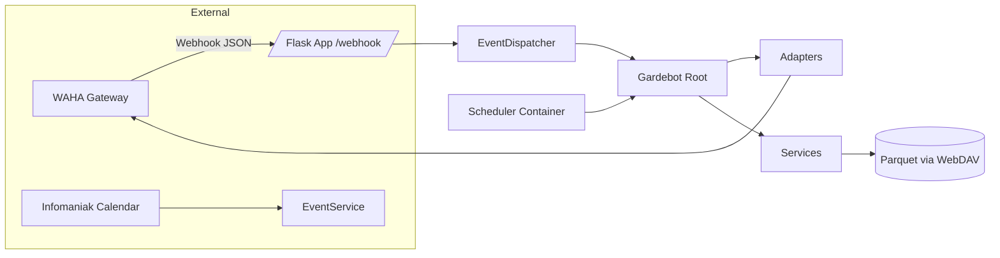

### Request Lifecycle (Webhook)

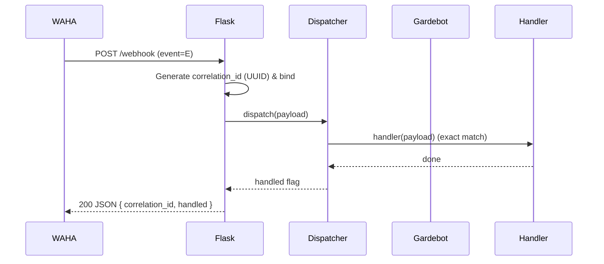

### Debounced Participant Sync

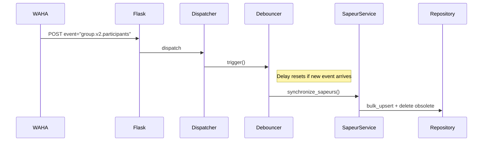

---

## Deep Dive: Internal Logic (src/gardebot)

### Application Entry (app.py)
- Single logging bootstrap.
- Correlation ID per request lifecycle.
- Validation: strict Pydantic parsing for `message` events; presence check for others.
- Metrics: `record_event` and error counters with latency measurement.

### Composition Root (gardebot.py)
- Instantiates WAHA client, adapters, and services once.
- `initialize()`: sync events, roster, create vote/on-duty tables, record metric.
- `process_vote()`: discriminate group vs admin (admin logic pending).
- `send_holiday_warning()`: notify admin on prevention-day-before-holiday.

### Event Dispatcher (dispatcher.py)
- Exact key mapping prevents substring ambiguity.
- Debouncers reduce redundant expensive sync calls on rapid events.
- Participant sync metric emitted post debounce.

### Settings (settings.py)
- Pydantic models for server/api/logging/backoff.
- Secrets loaded via helper for API key.

### Scheduler (scheduler.py)
- Cron jobs:
  - 02:00 `sync_events`
  - 09:00 `publish_polls`
  - 12:00 `warn_holidays`
- Independent job functions instantiate required services.

### Adapters
- polling.py: Publish polls, interpret votes, assign poll UID, mark events published.
- messaging.py: Send text/events/reminders/convocations with mention building.
- groups.py & contacts.py: Fetch participants + enrich contact metadata; deliver DataFrame to SapeurService.

### Services
- events.py: Calendar ingestion, publication schedule propagation, reminder management.
- votes.py: Record vote value (Présent/Absent/None), aggregate lists, completion checks.
- onduty.py: Headcount satisfaction evaluation & assignment persistence.
- sapeur.py: Roster synchronization (single fetch → insert + delete).
- message_service.py: Echo & command scaffolding.
- nomination.py: Participation scoring and forced nomination fallback logic.

### Repositories (repositories.py)
- Atomic parquet writes.
- Events: upsert by UID; poll lookup; poll UID assignment.
- Sapeurs: bulk upsert; deletion of stale members.
- Votes: wide matrix (rows=sapeurs, columns=polls) boolean presence storage.
- OnDuty: wide matrix; assigned flag computed vs event headcount.
- Consistent `NotFoundError` for missing resources.

### Models
- Event: computed `uid`, `poll_string`, publication scheduling, reminder cadence.
- Sapeur: joined_date normalization.
- VoteRecord: normalized row for wide vote matrix.
- OnDutyAssignment: aggregated assignment state.
- ParticipationScore: nomination scoring basis.
- MessageEventEnvelope: typed inbound WAHA messages.

### Validation
- Strong typing for message events; roadmap to extend to all event types.

### Errors & Logging
- Domain-specific error classes with sanitized Flask handlers.
- Correlation IDs ensure trace continuity.

### Debounce
- Resettable timer merges rapid triggers (participant changes and session status).

### Integrations
- InfomaniakCalendar: ICS fetch + cleaning (future events only, duplicate naming suffixing, NA row removal).
- WahaClient: High-level HTTP abstraction (JSON extraction, structured errors).

### HTTP Layer
- HttpClient: Request wrapper with exponential backoff + jitter, structured logging, selective raise-on-non-2xx.

---

## Process Graphs (Extended)

### Initialization Sequence
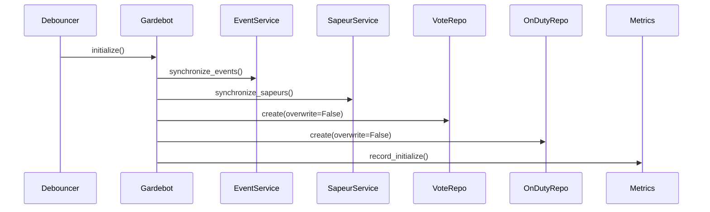

### Poll Publication Workflow
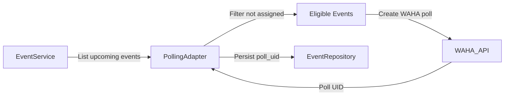

### Vote Ingestion & Persistence
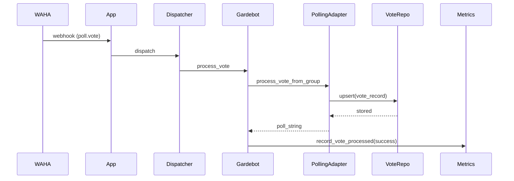

### Participant Sync Debounce
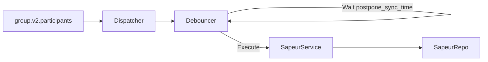

### On-Duty Assignment Evaluation
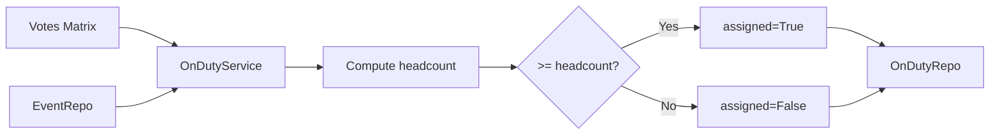

### Holiday Warning Flow
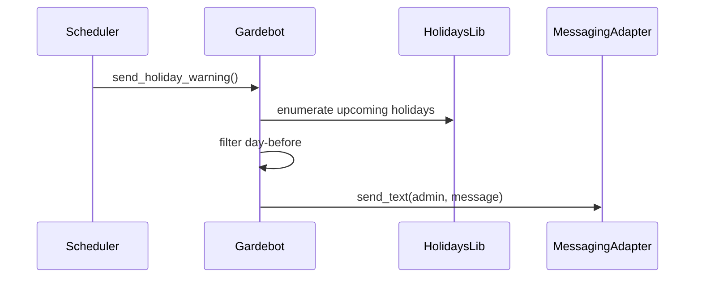

### Message Handling
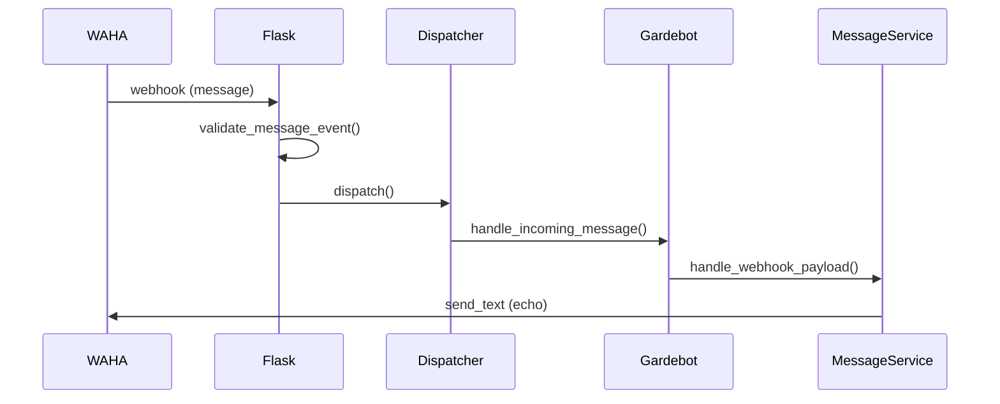

### Repository Layer Interaction
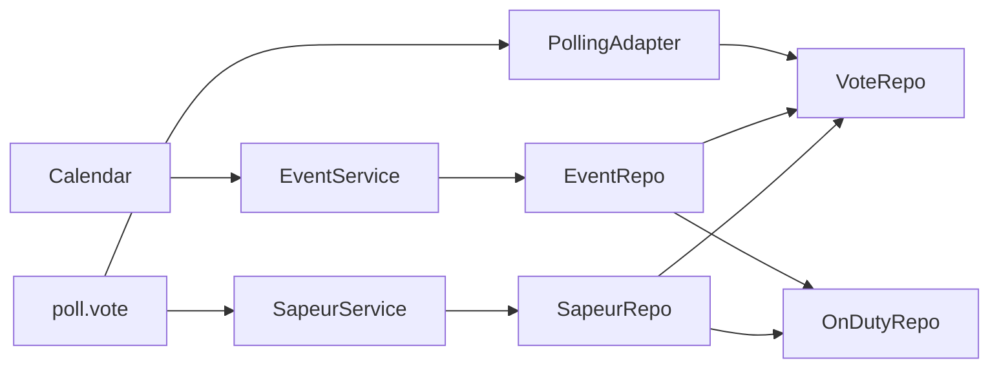

### Scheduler Timeline (Daily)
```mermaid
gantt
    dateFormat  HH:mm
    axisFormat  %H:%M
    title Daily Scheduled Jobs (Europe/Zurich)
    section Jobs
    Sync Events        :02:00, 15m
    Publish Polls      :09:00, 10m
    Holiday Warning    :12:00, 5m
```

---

## Event Types (Current)

| Event Name | Handler | Purpose |
|------------|---------|---------|
| `message` | `Gardebot.handle_incoming_message` | Command/echo handling |
| `poll.vote` | `Gardebot.process_vote` (→ PollingAdapter) | Availability voting |
| `session.status` | Debounced `Gardebot.initialize` | Re-initialize on WORKING status |
| `group.v2.participants` | Debounced `Gardebot.update_sapeurs` | Sync roster after membership changes |

---

## Metrics

| Metric | Type | Labels | Description |
|--------|------|--------|-------------|
| `gardebot_webhook_events_total` | Counter | event, handled | Webhook events processed |
| `gardebot_webhook_errors_total` | Counter | event, code | Error occurrences |
| `gardebot_webhook_latency_seconds` | Histogram | event | Webhook handling latency |
| `gardebot_participant_sync_total` | Counter | - | Participant sync executions |
| `gardebot_initialize_total` | Counter | - | Initialization runs |
| `gardebot_poll_publish_total` | Counter | status | Poll publish success/failure |
| `gardebot_vote_processed_total` | Counter | result | Vote processing success/error |

---

## Persistence Model

| File | Description | Repository |
|------|-------------|------------|
| `events.parquet` | Duty events (title, dates, headcount, poll metadata) | EventRepository |
| `sapeurs.parquet` | Participant roster snapshot | SapeurRepository |
| `votes.parquet` | Vote matrix (index=sapeur, columns=poll_string) | VoteRepository |
| `on_duty.parquet` | Assignment matrix (index=sapeur, columns=poll_string) | OnDutyRepository |

Limitation: Full DataFrame rewrite per mutation (future: normalized schema + DB backend).

---

## Configuration & Secrets

- Typed settings (`settings.py`) for server, API, logging, debounce.
- Legacy constants (`config.py`) slated for consolidation.
- Secrets via Doppler (`API_KEY`, `DOPPLER_TOKEN`, Kdrive credentials, `CALENDAR_URL`).
- Correlation IDs bound in logging context per request.

---

## Scheduler

Container `cron-jobs` activates:
- `sync_events` 02:00 daily.
- `publish_polls` 09:00 daily.
- `warn_holidays` 12:00 daily.

Planned: poll reminders & escalation workflows.

---

## Validation & Error Handling

- Typed envelope for `message` events (`MessageEventEnvelope`).
- Other events: presence check (roadmap: typed).
- Errors: `GardebotError`, `ExternalServiceError`, `ValidationError`, `NotFoundError`.
- Flask handlers sanitize output; metrics capture failures.

---

## Correlation IDs

Each webhook request attaches a UUID (`correlation_id`) to response and log context; cleared post-processing to prevent leakage.

---

## Extensibility Guidelines

1. New event:
   - Add Pydantic envelope.
   - Register exact key in dispatcher.
   - Implement handler.
   - Add metric & README entry.

2. Scheduler:
   - Add function + cron job.
   - Instrument with metrics.

3. Persistence migration:
   - Introduce normalized row schema (poll_string, sapeur_uid, timestamp).
   - Migrate to transactional DB.

4. Localization:
   - Externalize French user-facing strings.

5. Assignment decoupling:
   - Separate poll publication from assignment algorithm.

---

## Testing (Recommended Coverage)

| Area | Tests |
|------|-------|
| Dispatcher | Exact match, debounce timing |
| Webhook | Correlation ID, invalid JSON, invalid event |
| Repositories | NotFoundError, headcount satisfaction |
| Calendar | Duplicate names, NA row removal |
| Metrics | Counters increment paths |
| Scheduler | Cron job invocation (time mocking) |
| Voting | Present/Absent/None flows, missing poll_id/voter_id |
| Sapeur Sync | Insert & delete detection |
| Debounce | Rapid triggers → single execution |
| Message Commands | Echo integrity |
| Holiday Warning | Date offset correctness |

---

## Known Limitations / Technical Debt

| Topic | Limitation | Planned |
|-------|------------|---------|
| Event validation | Only message typed | Typed envelopes for all events |
| Persistence | Full DataFrame rewrites | DB backend (row-level ops) |
| Admin vote | Not implemented | Admin-specific logic |
| Assignment logic | Coupled with publication | Separation & analytics |
| Fair rotation | Basic nomination | Weighted rotation algorithm |
| Reminders | Disabled cron path | Reintroduce configurable reminders |

---

## Quick Start

```bash
make
poetry run python -m gardebot.app
docker compose up --build
```

---

## Troubleshooting

| Symptom | Cause | Fix |
|---------|-------|-----|
| Missing correlation_id | Old route or mismatch | Redeploy updated image |
| Poll not publishing | Not due / already assigned | Check `scheduled_publication_date` & assignment |
| Vote ignored | Poll satisfied headcount | Verify OnDuty matrix |
| Empty events | Missing calendar URL | Set `CALENDAR_URL` secret |
| Participant sync delays | Debounce window | Adjust `POSTPONE_SYNC_TIME` |
| Metric missing | Scrape failure | Verify `/metrics` endpoint |
| Scheduler job not firing | TZ mismatch | Confirm container timezone |

---

## Roadmap

1. Typed envelopes for all events.
2. DB-backed persistence (transactional).
3. Reminder & escalation workflows.
4. Participation analytics endpoint.
5. Localization & multi-language poll strings.
6. Fair nomination & rotation scoring.
7. Incremental diff sync for events.
8. Admin vote interface & overrides.

---

## License

See `LICENSE`.

---

## Acknowledgements

- CookieBlueprint scaffold
- WAHA project
- Infomaniak (Calendar & Kdrive)
- Doppler
- Python OSS community

---

Happy automating! 🚀
