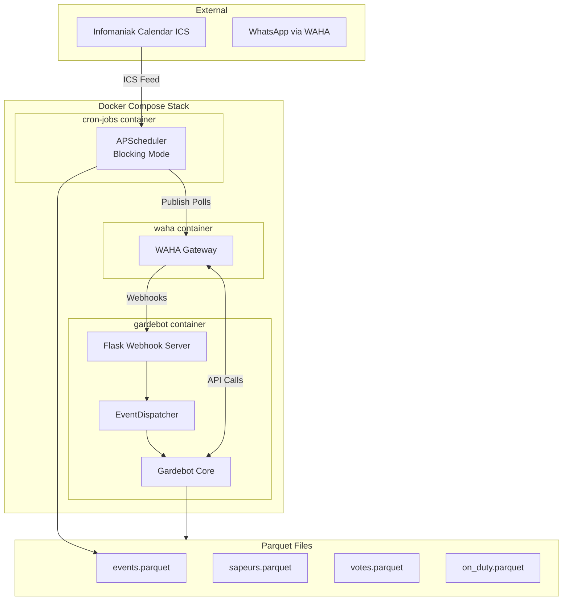
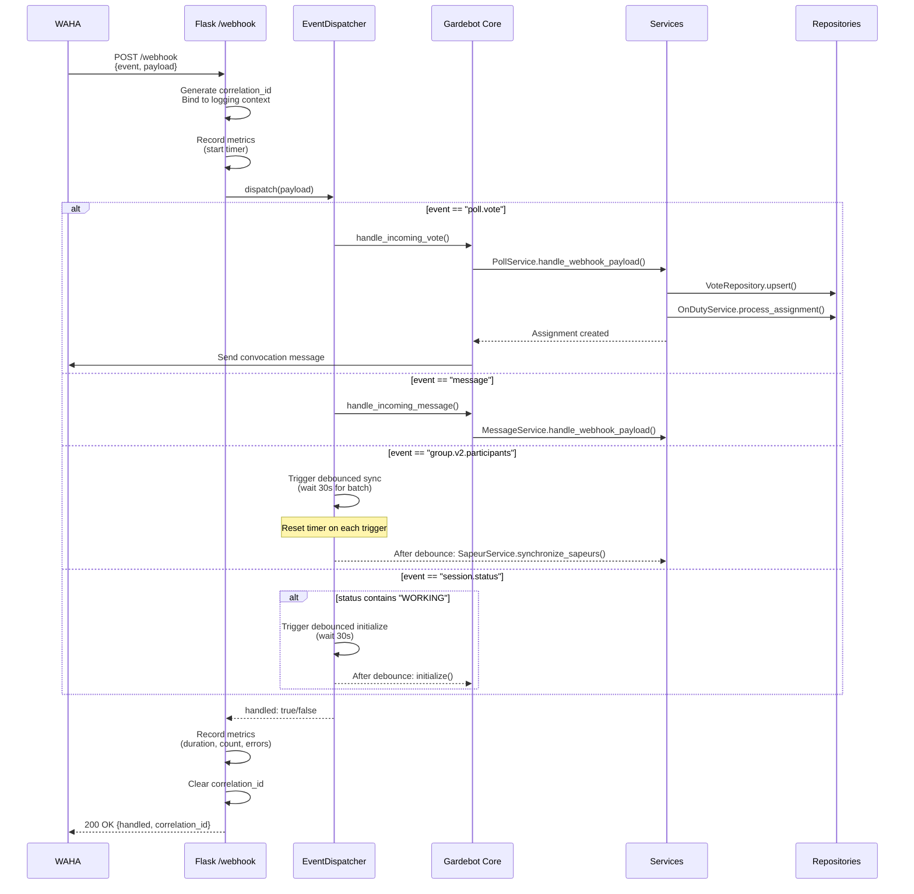
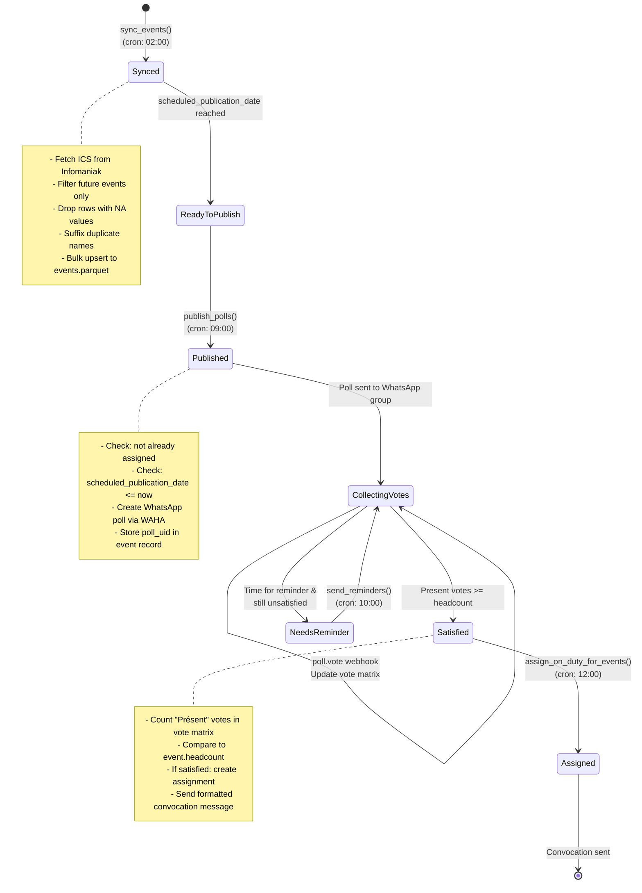
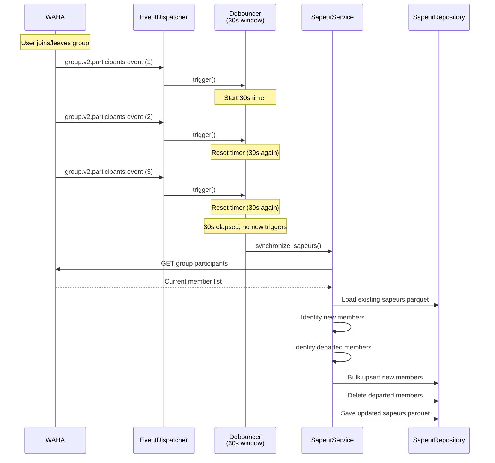
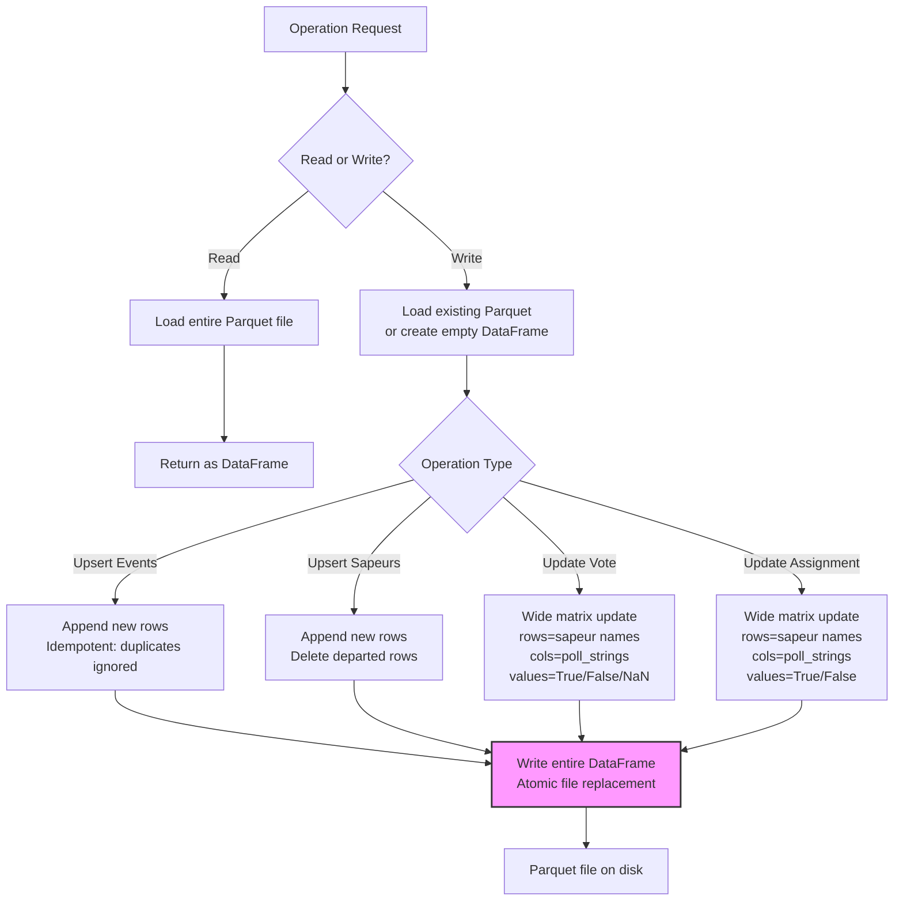

# Gardebot

Gardebot is a Python 3.11 WhatsApp automation service for duty ("garde") scheduling. It integrates with Infomaniak Calendar and WAHA (WhatsApp HTTP API) to manage availability polling, vote collection, and on-duty assignments for a WhatsApp group.

---

## Overview

Gardebot operates through three synchronized processes:

1. **Scheduled Jobs** (cron-jobs container) — Periodic tasks that sync events, publish polls, send assignments, and warn about holidays
2. **Webhook Processing** (gardebot container) — Real-time handling of WhatsApp events (messages, votes, group changes)
3. **Data Persistence** — Atomic Parquet file storage for events, participants, votes, and assignments

---

## Architecture

### System Components



### Request Flow: Webhook Processing



---

## Process Flows

### 1. Event Lifecycle (Calendar → Poll → Vote → Assignment)



**Key Points:**

- **Event Sync** (02:00 daily): Downloads ICS, extracts future events, performs data cleaning (removes NA, handles duplicate titles), and bulk-upserts new events to `events.parquet`
- **Poll Publication** (09:00 daily): Iterates events where `scheduled_publication_date <= now` and `is_assigned() == False`, creates WhatsApp poll via WAHA API, stores `poll_uid`
- **Vote Collection** (real-time): Each `poll.vote` webhook updates the vote matrix (`votes.parquet`) with voter's response (Présent/Absent)
- **Assignment** (12:00 daily): When `present_count >= event.headcount`, creates assignment in `on_duty.parquet` and sends WhatsApp convocation message

### 2. Participant (Sapeur) Synchronization



**Purpose:** Debouncing prevents multiple rapid API calls when several members join/leave simultaneously (e.g., group creation, mass removal). The 30-second window batches all changes into a single synchronization.

### 3. Data Persistence Strategy



**File Structure:**

| File | Schema | Update Pattern |
|------|--------|----------------|
| **events.parquet** | `[title, start_date, end_date, location, headcount, poll_string, poll_uid, ...]` | Bulk append (new events only) |
| **sapeurs.parquet** | `[uid, name, phone, pushname, joined_date]` | Insert new + delete departed |
| **votes.parquet** | Wide matrix: rows=`sapeur_name`, cols=`poll_string_N`, cells=`True/False/NaN` | Cell updates (NaN = no vote yet) |
| **on_duty.parquet** | Wide matrix: rows=`sapeur_name`, cols=`poll_string_N`, cells=`True/False` | Row-level assignment flags |

**Atomicity:** Each write operation loads the entire file, modifies in-memory DataFrame, then performs atomic replacement. Suitable for single-instance deployment; concurrent writes would require database migration.

---

## Scheduled Jobs (cron-jobs container)

The scheduler container runs five periodic tasks in the `Europe/Zurich` timezone:

```python
scheduler.add_job(sync_events,        "cron", hour=2)   # 02:00 AM
scheduler.add_job(publish_polls,      "cron", hour=9)   # 09:00 AM
scheduler.add_job(send_reminders,     "cron", hour=10)  # 10:00 AM
scheduler.add_job(send_assignments,   "cron", hour=12)  # 12:00 PM
scheduler.add_job(warn_holidays,      "cron", hour=12)  # 12:00 PM
```

### Task Details

| Time | Function | Description |
|------|----------|-------------|
| **02:00** | `sync_events()` | Fetch ICS from Infomaniak → parse future events → clean data → bulk upsert to `events.parquet` |
| **09:00** | `publish_polls()` | Find events where `scheduled_publication_date <= now` AND not assigned → create WhatsApp poll → store `poll_uid` |
| **10:00** | `send_reminders()` | Check each event's `should_send_reminder()` → send WhatsApp message with mentions → increment `event.nb_reminder` |
| **12:00** | `send_assignments()` | For each satisfied event (`present_votes >= headcount`) → create assignment → send convocation message |
| **12:00** | `warn_holidays()` | Check Swiss (Geneva) holidays → if `days_until == PREVENTION_DAY_BEFORE_HOLIDAY` → notify admin |

**Note:** Reminders are scaffolded but currently disabled in production until full workflow validation.

---

## Domain Models

### Event

```python
class Event:
    title: str
    start_date: pd.Timestamp
    end_date: pd.Timestamp
    location: str
    headcount: int
    poll_string: str              # "Title | DD.MM.YYYY HH:MM - DD.MM.YYYY HH:MM | Location"
    poll_uid: Optional[str]
    scheduled_publication_date: pd.Timestamp
    nb_reminder: int
    
    def should_send_reminder(self) -> bool:
        """Reminder logic based on time_until_event and nb_reminder."""
    
    def is_assigned(self) -> bool:
        """Check if on_duty.parquet contains assignment for this poll_string."""
```

**poll_string** serves as the primary logical key linking events, votes, and assignments.

### Sapeur (Participant)

```python
class Sapeur:
    uid: str         # WhatsApp contact ID
    name: str
    phone: str
    pushname: str
    joined_date: pd.Timestamp
```

### Vote

Stored as wide matrix in `votes.parquet`:
- **Rows:** Sapeur names
- **Columns:** `poll_string_1`, `poll_string_2`, ...
- **Values:** `True` (Présent), `False` (Absent), `NaN` (no response)

### OnDutyAssignment

```python
class OnDutyAssignment:
    event: Event
    sapeur_list: List[Sapeur]
```

Stored as wide matrix in `on_duty.parquet`:
- **Rows:** Sapeur names
- **Columns:** `poll_string_1`, `poll_string_2`, ...
- **Values:** `True` (assigned), `False` (not assigned)

---

## Code Organization

```
src/gardebot/
├── adapters/          # High-level WAHA wrappers (polling, messaging, groups)
├── common/            # Utilities (logging, debounce, storage helpers, formatting)
├── http/              # Resilient HTTP client (retries, backoff, jitter)
├── integrations/      # External service clients (Infomaniak ICS, WAHA API)
├── models/            # Pydantic domain models (Event, Sapeur, VoteRecord, etc.)
├── services/          # Business logic orchestration
│   ├── events.py      # Event synchronization
│   ├── poll_service.py # Poll publication & vote processing
│   ├── sapeur.py      # Participant roster management
│   ├── votes.py       # Vote matrix operations
│   ├── onduty.py      # Assignment logic
│   └── message_service.py # WhatsApp messaging (convocation, reminders)
├── app.py             # Flask application (webhook, health, metrics endpoints)
├── dispatcher.py      # Event routing with debouncing
├── gardebot.py        # Composition root (dependency injection)
├── repositories.py    # Parquet persistence layer
├── scheduler.py       # APScheduler cron job definitions
├── settings.py        # Configuration (environment variables, secrets)
└── validation.py      # Webhook payload validation
```

---

## Configuration

### Environment Variables

**Server:**
- `SERVER_HOST` (default: `0.0.0.0`)
- `SERVER_PORT` (default: `5000`)
- `SERVER_DEBUG` (default: `false`)
- `POSTPONE_SYNC_TIME` (default: `30`) — Debounce window in seconds

**WAHA Integration:**
- `WAHA_BASE_URL` (default: `http://waha:3000`)
- `WAHA_SESSION` (default: `default`)
- `API_KEY` (secret, required) — WAHA API authentication

**Calendar:**
- `CALENDAR_URL` (secret, required) — Infomaniak ICS endpoint

**Logging:**
- `LOG_LEVEL` (default: `INFO`)
- `LOG_JSON` (default: `false`)

**Secrets (via Doppler or .env):**
- `ADMIN_NUMBER` — International format phone number for admin notifications
- `PREVENTION_DAY_BEFORE_HOLIDAY` — Days ahead to warn about holidays

---

## Observability

### Metrics (Prometheus)

Endpoint: `http://localhost:5000/metrics`

| Metric | Type | Labels | Description |
|--------|------|--------|-------------|
| `gardebot_webhook_events_total` | Counter | `event`, `handled` | Total webhook events received |
| `gardebot_webhook_errors_total` | Counter | `event`, `code` | Errors by event type and code |
| `gardebot_webhook_latency_seconds` | Histogram | `event` | Processing duration distribution |
| `gardebot_participant_sync_total` | Counter | — | Debounced roster sync count |
| `gardebot_initialize_total` | Counter | — | Full initialization count |
| `gardebot_poll_publish_total` | Counter | `status` | Poll publication success/failure |
| `gardebot_vote_processed_total` | Counter | `result` | Vote processing outcomes |

### Correlation IDs

Each webhook request generates a UUID correlation ID:
1. Bound to logging context via `structlog`
2. Included in all log entries for that request
3. Returned in webhook response
4. Cleared after request completion

Example log entry:
```json
{
  "event": "poll.vote",
  "correlation_id": "a1b2c3d4-...",
  "poll_string": "Garde | 15.01.2025 08:00 - 16.01.2025 08:00 | Caserne",
  "voter": "John Doe",
  "vote": "Présent",
  "timestamp": "2025-01-10T09:15:23Z"
}
```

### Health Check

Endpoint: `http://localhost:5000/health`

Response:
```json
{
  "status": "healthy",
  "timestamp": "2025-01-10T12:00:00Z"
}
```

Docker healthcheck runs every 30s with 3 retries.

---

## Deployment

### Docker Compose

Three containers orchestrated in `docker-compose.yaml`:

```yaml
services:
  waha:          # WhatsApp HTTP API gateway
  gardebot:      # Flask webhook server
  cron-jobs:     # APScheduler daemon
```

**Startup:**
```bash
docker compose up --build
```

**Ports:**
- `3000` → WAHA dashboard
- `5000` → Gardebot webhook/metrics

**Volumes:**
- `./.sessions:/app/.sessions` — WAHA session persistence
- Parquet files stored in container filesystem (consider volume mount for production)

### Local Development

```bash
# Install dependencies
poetry install

# Activate virtual environment
poetry shell

# Run webhook server
python -m gardebot.app

# Run scheduler (separate terminal)
python -m gardebot.scheduler
```

---

## Testing Strategy

| Component | Test Focus |
|-----------|------------|
| **Webhooks** | Valid/invalid payloads, correlation ID propagation, metric recording |
| **Dispatcher** | Exact event matching, debounce timing (with time mocks), unhandled events |
| **Repositories** | Upsert idempotency, `NotFoundError` conditions, matrix operations |
| **Event Service** | Duplicate name suffixing, NA filtering, future-only events |
| **Poll Service** | Publication guards (not due/already assigned), poll UID tracking |
| **Vote Service** | Matrix updates, invalid vote rejection, headcount satisfaction |
| **Sapeur Service** | Bulk insert/delete, debounced sync behavior |
| **HTTP Client** | Retry/backoff logic, error propagation, jitter randomization |
| **Assignment Logic** | Satisfaction conditions, convocation message formatting |

---

## Roadmap

1. **Typed Event Envelopes** — Pydantic models for all webhook events
2. **Database Migration** — PostgreSQL with transactional guarantees
3. **Reminder Workflow** — Enable automated reminders with escalation
4. **Analytics Dashboard** — Participation metrics and visualizations
5. **Multi-Language Support** — Externalize strings, support locale switching
6. **Assignment Override** — Admin UI for manual assignment adjustments
7. **Incremental Calendar Sync** — Diff-based updates vs. full rescan
8. **Webhook Signature Verification** — Security hardening with HMAC
9. **Nomination Fairness** — Advanced scoring (rotation, fatigue, preferences)
10. **Automated Testing** — CI/CD pipeline with unit/integration tests

---

## Troubleshooting

| Symptom | Likely Cause | Solution |
|---------|--------------|----------|
| No events loaded | Missing/invalid `CALENDAR_URL` | Verify secret, check ICS endpoint accessibility |
| Poll not published | Not due OR already assigned | Check `scheduled_publication_date`, verify `is_assigned()` |
| Votes ignored | Headcount satisfied | Check assignment state, confirm `present_count < headcount` |
| Stale roster | Debounce too long OR missed trigger | Lower `POSTPONE_SYNC_TIME`, force `initialize()` |
| Missing metrics | Scrape config OR endpoint down | Verify `/metrics` accessible, check Prometheus config |
| Duplicate holiday warnings | Incorrect prevention constant | Adjust `PREVENTION_DAY_BEFORE_HOLIDAY` |
| Session disconnected | WAHA session expired | Check WAHA logs, scan QR code to re-authenticate |

---

## License

See `LICENSE` file.

---

## Acknowledgements

- [WAHA](https://waha.devlike.pro/) — WhatsApp HTTP API
- [Infomaniak](https://www.infomaniak.com/) — Calendar hosting
- [Doppler](https://www.doppler.com/) — Secrets management
- Python OSS community

---

**Built with structured logging, typed domain models, and resilient HTTP abstractions.** 🚀
