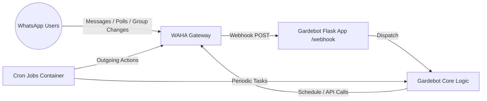
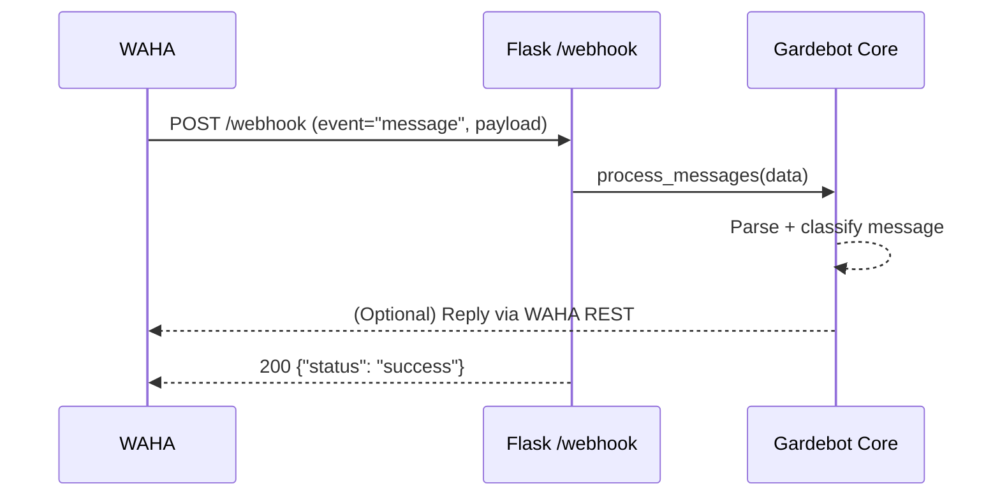
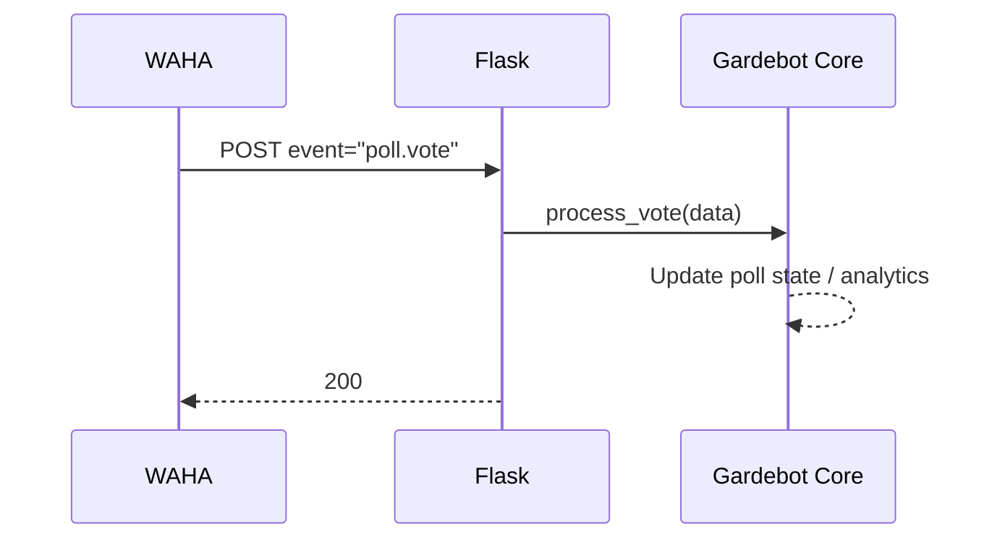
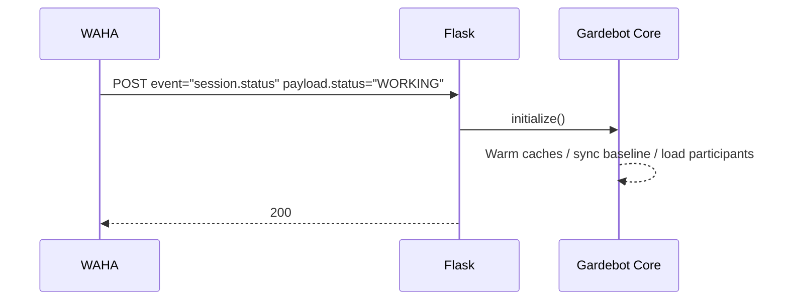
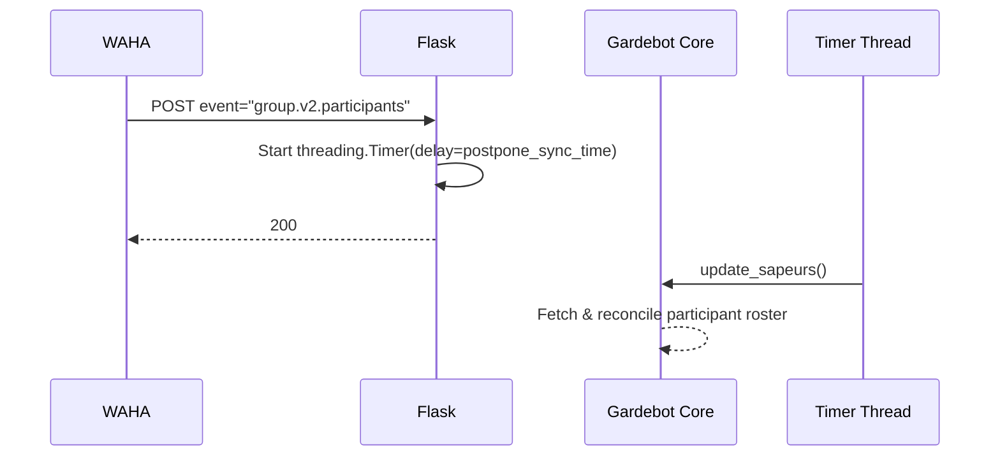

> NOTE: This repository was bootstrapped from the [🍪 CookieBlueprint](https://github.com/Julien-hae/CookieBlueprint). It extends that scaffold into a containerized WhatsApp automation service with a scheduled jobs companion.

# Gardebot

Gardebot is a Python 3.11 based service intended to interact with the WAHA (WhatsApp HTTP API) gateway and expose a small Flask-powered webhook & API layer while also running periodic background tasks (cron-like) via APScheduler.  
It ships with a modern Python tooling stack: Poetry for dependency management, pre-commit automation, formatting (black + isort), linting (pylint), type checking (mypy), docstring style enforcement (pydocstyle), and coverage-aware test execution.  
Secrets are injected at runtime using the Doppler CLI.

---

## At a Glance

| Aspect | Technology |
|--------|------------|
| Runtime | Python 3.11 |
| Web Framework | Flask |
| Scheduling | APScheduler |
| Data / Utilities | numpy, pandas, pyarrow, holidays, regex, icalendar |
| External Integration | WAHA (WhatsApp API), Doppler (secrets) |
| Packaging | Poetry (wheel build during Docker image build) |
| Quality Tooling | black, isort, pylint (+ sonarjson), mypy, pydocstyle, coverage |
| Deployment | Multi-stage Dockerfile + docker-compose |
| Entry Points | `python -m gardebot.app` (webhook/API), `python -m gardebot.scheduler` (cron-jobs), `poetry run entrypoint` (CLI) |

---

## Repository Layout

| Path / File | Purpose |
|-------------|---------|
| `src/gardebot/` | Python package containing application code (web app, scheduler, supporting modules). |
| `tests/` | Test package (discovery by `unittest` / xmlrunner). |
| `pyproject.toml` | Project metadata, dependencies, tool configuration (pylint, mypy, isort, etc.). |
| `poetry.lock` | Locked dependency versions for reproducible installs. |
| `Dockerfile` | Multi-stage build producing a slim runtime image with an embedded virtual environment. |
| `docker-compose.yaml` | Orchestrates: WAHA gateway, main app (`gardebot`), and a `cron-jobs` scheduler container. |
| `Makefile` | Developer convenience targets (environment bootstrap & cleanup). |
| `.pre-commit-config.yaml` | Defines automated checks run before each commit. |
| `.gitattributes`, `.gitignore` | Git hygiene and line ending consistency. |
| `LICENSE` | Project license. |

---

## Architectural Overview

Gardebot is designed as three cooperating containers in `docker-compose.yaml`:

1. `waha`  
   - External WhatsApp gateway (image: `devlikeapro/waha:latest`).  
   - Sends event callbacks (messages, poll votes, participant updates, session status) to `gardebot` via `WHATSAPP_HOOK_URL`.

2. `gardebot`  
   - Flask application exposing `/webhook` to accept WAHA event payloads.  
   - Dispatches processing to methods of the `Gardebot` core object.  
   - Runs under an unprivileged user (UID 1001).  
   - Uses Doppler for secrets.

3. `cron-jobs`  
   - Executes `python -m gardebot.scheduler`.  
   - Uses APScheduler to perform recurring tasks (reminders, sync, enrichments, etc.).  

---

## Webhook Event Processing Logic (app.py)

The central decision logic in `src/gardebot/app.py`:

```python
if "message" in data.get("event"):
    gardebot.process_messages(data)
elif "poll.vote" in data.get("event"):
    gardebot.process_vote(data)
elif "session.status" in data.get("event"):
    if "WORKING" in data.get("payload").get("status"):
        gardebot.initialize()
elif "group.v2.participants" in data.get("event"):
    threading.Timer(
        SERVER_CONFIG["postpone_sync_time"],
        gardebot.update_sapeurs,
    ).start()
else:
    LOGGER.info("Unhandled webhook data shape: %s", data)
```

### Semantics

| Event Fragment | Handler | Purpose |
|----------------|---------|---------|
| `message` | `process_messages` | Inbound chat messages (text / media / commands). |
| `poll.vote` | `process_vote` | User participation in a WhatsApp poll. |
| `session.status` (WORKING) | `initialize` | Re-run any startup routines (e.g., cache warmup, sync) once gateway session becomes operational. |
| `group.v2.participants` | `update_sapeurs` (delayed) | Synchronize group participants after a postponement buffer to batch rapid membership changes. |
| (other) | log only | Fallback for unexpected or new event types. |

---

## Event Flow Diagrams

### 1. High-Level Container Interaction



### 2. Webhook Dispatch Flow (Decision Tree)

```mermaid
flowchart TD
    A[Webhook Event Received] --> B{event contains 'message'?}
    B -->|Yes| M[process_messages()]
    B -->|No| C{event contains 'poll.vote'?}
    C -->|Yes| V[process_vote()]
    C -->|No| D{event contains 'session.status'?}
    D -->|Yes| E{payload.status includes 'WORKING'?}
    E -->|Yes| I[initialize()]
    E -->|No| X1[Ignore / Log]
    D -->|No| G{event contains 'group.v2.participants'?}
    G -->|Yes| T[Start Timer -> update_sapeurs()]
    G -->|No| U[Log Unhandled]
    M --> Z[Return success]
    V --> Z
    I --> Z
    X1 --> Z
    T --> Z
    U --> Z
```

### 3. Sequence: Inbound Message



### 4. Sequence: Poll Vote



### 5. Sequence: Session Status Transition



### 6. Sequence: Group Participants Update (Deferred Sync)



### 7. ASCII Fallback Diagram (Dispatch)

```
[Webhook JSON] --> (Check 'event')
   |-- contains "message" ----------> process_messages()
   |-- contains "poll.vote" --------> process_vote()
   |-- contains "session.status" ---> if status has WORKING -> initialize()
   |-- contains "group.v2.participants" -> Timer(delay)-> update_sapeurs()
   \-- else ------------------------> log "Unhandled webhook data shape"
```

---

## Concurrency Notes

- `group.v2.participants` events may arrive in bursts (e.g., multiple joins). Deferring `update_sapeurs()` via `threading.Timer` helps collapse rapid-fire updates into a single sync.
- All handlers run inside the Flask request thread (except the deferred sync). Keep per-request logic lightweight; offload heavier work to background jobs or the scheduler where appropriate.
- If you introduce shared mutable state inside `Gardebot`, consider thread-safety (locks or isolation) since multiple webhook requests can be processed concurrently.

---

## Local Development

### Prerequisites

- Python build toolchain
- `pyenv`
- `poetry`
- Docker & Docker Compose (optional but recommended)
- Doppler CLI (for secret-managed flows)

### Bootstrapping

```bash
git clone git@github.com:Julien-hae/Gardebot.git
cd Gardebot
make          # sets local Python 3.11, installs deps, pre-commit hooks
poetry shell  # activate environment (if not auto-activated)
```

### Running

```bash
poetry run python -m gardebot.app          # Flask webhook service
poetry run python -m gardebot.scheduler    # Scheduler (cron-jobs logic)
poetry run entrypoint --help               # CLI entrypoint
```

### Docker Compose

```bash
docker compose up --build
```

Services: `waha`, `gardebot`, `cron-jobs`.

---

## Quality & Tooling

| Action | Command |
|--------|---------|
| Format | `poetry run black .` |
| Imports | `poetry run isort .` |
| Lint | `poetry run pylint src/gardebot` |
| Types | `poetry run mypy` |
| Docstrings | `poetry run pydocstyle` |
| Tests | `poetry run coverage run -m xmlrunner discover --output-file junittest.xml` |
| Pre-commit (all) | `poetry run pre-commit run --all-files` |

---

## Building Docker Image

```bash
docker build -t gardebot:local .
```

Multi-stage build:
1. Install Poetry + deps (runtime subset).
2. Build wheel.
3. Copy virtual environment to final slim image.
4. Run as non-root (UID 1001).
5. Entrypoint uses Doppler to inject secrets.

---

## Environment Variables

| Variable | Purpose | Example |
|----------|---------|---------|
| SERVER_HOST | Flask host bind | `0.0.0.0` |
| SERVER_PORT | Flask port | `5000` |
| SERVER_DEBUG | Flask debug flag | `false` |
| LOG_LEVEL | App log level | `INFO` |
| WAHA_BASE_URL | WAHA API URL | `http://waha:3000` |
| WAHA_SESSION | WhatsApp session name | `default` |
| TZ | Time zone in some containers | `Europe/Zurich` |
| WHATSAPP_HOOK_URL | WAHA webhook target | `http://gardebot:5000/webhook` |
| WHATSAPP_HOOK_EVENTS | Subscribed events | `message,poll.vote,session.status,group.v2.participants` |

Secrets (tokens, API keys) are expected via Doppler or environment files referenced in `docker-compose.yaml`.

---

## Extending Event Handling

Add new handlers by:
1. Updating the conditional chain (or refactor to a dispatch map).
2. Implementing a corresponding method on `Gardebot`.
3. Adding tests under `tests/gardebot/`.
4. Documenting the new event in the Event Flow section.
5. Considering debouncing or batching if high-frequency.

Example refactor (future improvement):

```python
DISPATCH = {
    "message": Gardebot.process_messages,
    "poll.vote": Gardebot.process_vote,
    "session.status": lambda g, d: g.initialize() if "WORKING" in d.get("payload", {}).get("status", "") else None,
    "group.v2.participants": lambda g, d: threading.Timer(SERVER_CONFIG["postpone_sync_time"], g.update_sapeurs).start(),
}
```

---

## Troubleshooting

| Symptom | Cause | Fix |
|---------|-------|-----|
| 400 on /webhook | Invalid JSON | Ensure WAHA payload format correct. |
| Missing initialization effects | Session not yet WORKING | Wait for `session.status` with WORKING state. |
| Multiple participant syncs | Rapid events | Adjust `postpone_sync_time`. |
| No outgoing messages | WAHA_BASE_URL incorrect | Verify service name & network in compose. |

---

## Contributing

1. Branch from `master` (`feat/...`, `fix/...`).
2. Keep commits focused.
3. Ensure hooks pass (`pre-commit run --all-files`).
4. Add or update tests for new logic.
5. Provide diagrams if adding new event types.

---

## Roadmap Ideas

- Central event dispatcher replacing chained if/elif.
- Structured logging (JSON) with correlation IDs per webhook request.
- Persistence layer for message analytics / poll aggregation.
- Web UI / admin dashboard for status & scheduling controls.
- Retry / dead-letter queue for failed handlers.

---

## License

See `LICENSE`.

---

## Acknowledgements

- CookieBlueprint
- WAHA project
- Doppler
- Python OSS ecosystem

---

Happy automating! 🛠️📨
