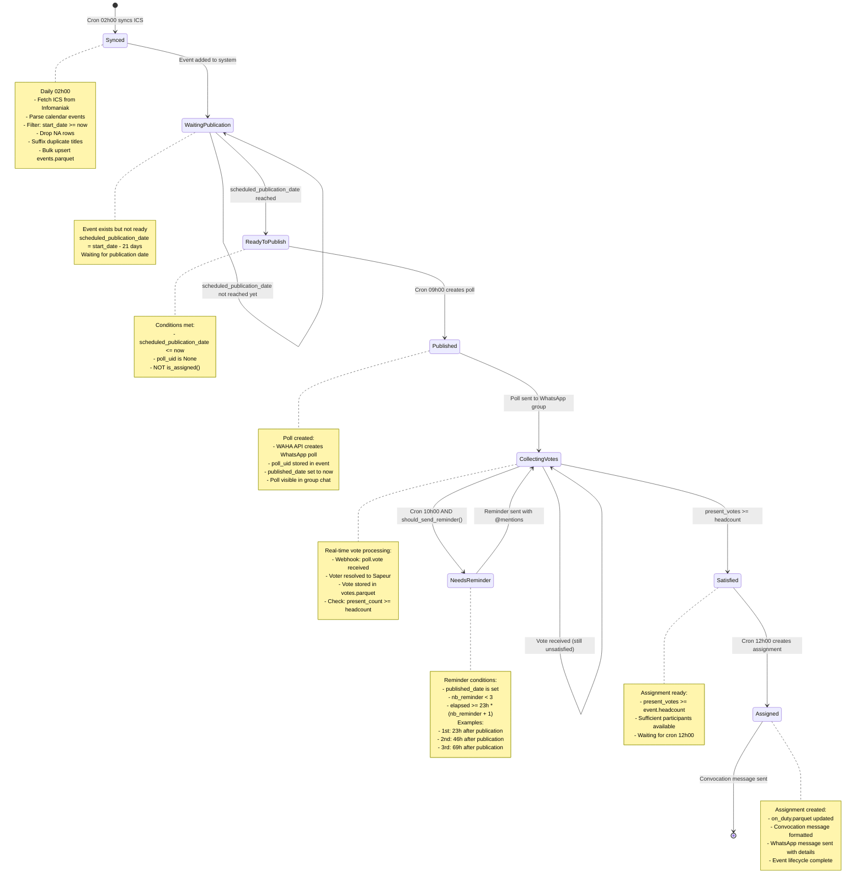

### 1. Event Lifecycle: Calendar to Assignment

**State Transitions:**



**Detailed Process Flow:**

| State | Entry Condition | Actions Performed | Exit Condition | Data Modified |
|-------|----------------|-------------------|----------------|---------------|
| **Synced** | Cron 02h00 triggers | 1. HTTP GET ICS feed<br/>2. Parse iCalendar<br/>3. Filter future events<br/>4. Clean data (drop NA, suffix duplicates)<br/>5. Bulk upsert to events.parquet | All events processed | `events.parquet` (new rows) |
| **WaitingPublication** | Event added to system | Event exists in database<br/>`scheduled_publication_date` calculated as `start_date - 21 days` | `now() >= scheduled_publication_date` | None (waiting) |
| **ReadyToPublish** | Publication date reached | Event eligible for poll creation<br/>Awaiting cron 09h00 | Cron 09h00 runs | None (ready state) |
| **Published** | Cron 09h00 triggers | 1. Call WAHA API to create poll<br/>2. Receive `poll_uid` from WAHA<br/>3. Set `poll_uid` in event<br/>4. Set `published_date` to now<br/>5. Poll appears in WhatsApp group | Poll created successfully | `events.parquet` (`poll_uid`, `published_date`) |
| **CollectingVotes** | Poll sent to group | 1. Webhook `poll.vote` received<br/>2. Parse voter ID and vote choice<br/>3. Resolve voter to Sapeur<br/>4. Update `votes.parquet` matrix<br/>5. Count present votes<br/>6. Compare to `event.headcount` | `present_count >= headcount` OR reminder needed | `votes.parquet` (cell updates) |
| **NeedsReminder** | Cron 10h00 AND reminder conditions met | 1. Check `should_send_reminder()`<br/>2. Send WhatsApp message with @mentions<br/>3. Increment `nb_reminder` counter<br/>4. Return to collecting votes | Reminder sent | `events.parquet` (`nb_reminder`) |
| **Satisfied** | Present votes >= headcount | Headcount requirement met<br/>Event ready for assignment<br/>Awaiting cron 12h00 | Cron 12h00 runs | None (satisfied state) |
| **Assigned** | Cron 12h00 triggers | 1. Create `OnDutyAssignment` object<br/>2. Update `on_duty.parquet` matrix<br/>3. Format convocation message (French)<br/>4. Send WhatsApp message<br/>5. Event lifecycle complete | Assignment created | `on_duty.parquet` (row updates) |

**Key Decision Points:**

| Question | Logic | Outcome |
|----------|-------|---------|
| **Is event ready to publish?** | `scheduled_publication_date <= now` AND `poll_uid is None` AND NOT `is_assigned()` | Yes → ReadyToPublish<br/>No → WaitingPublication |
| **Should send reminder?** | `published_date is set` AND `nb_reminder < MAX_NB_REMINDER (3)` AND `elapsed_hours >= MINIMUM_ELAPSED_HOURS (23) * (nb_reminder + 1)` | Yes → NeedsReminder<br/>No → Stay in CollectingVotes |
| **Is headcount satisfied?** | `count(votes where value=True) >= event.headcount` | Yes → Satisfied<br/>No → Stay in CollectingVotes |
| **Should create assignment?** | Event is in `Satisfied` state AND cron 12h00 runs AND NOT already `is_assigned()` | Yes → Assigned<br/>No → Wait |

**Example Timeline for Event "Garde 15 janvier 2025":**

```
start_date = 2025-01-15 08:00
scheduled_publication_date = 2025-01-15 - 21 days = 2024-12-25 08:00

2024-12-24 02:00 → Synced (event added to events.parquet)
2024-12-24 09:00 → WaitingPublication (not ready yet, waiting until 12-25)
2024-12-25 09:00 → Published (cron creates poll, poll_uid="abc123", published_date=2024-12-25 09:00)
2024-12-25 09:15 → CollectingVotes (Alice votes "Présent", 1/3)
2024-12-25 10:30 → CollectingVotes (Bob votes "Présent", 2/3)
2024-12-26 08:00 → NeedsReminder (23h elapsed, nb_reminder=0, send 1st reminder)
2024-12-26 14:00 → CollectingVotes (Claire votes "Présent", 3/3)
2024-12-26 14:00 → Satisfied (headcount met: 3 >= 3)
2024-12-26 12:00 → Assigned (cron creates assignment, sends convocation)
```

**State Retention:**
- Events remain in `CollectingVotes` until satisfied OR event date passes
- Events can cycle between `CollectingVotes` ↔ `NeedsReminder` up to 3 times (MAX_NB_REMINDER)
- Once `Assigned`, events are terminal and no further processing occurs
- If event date passes without satisfaction, event stays in database but no assignment created (edge case)
