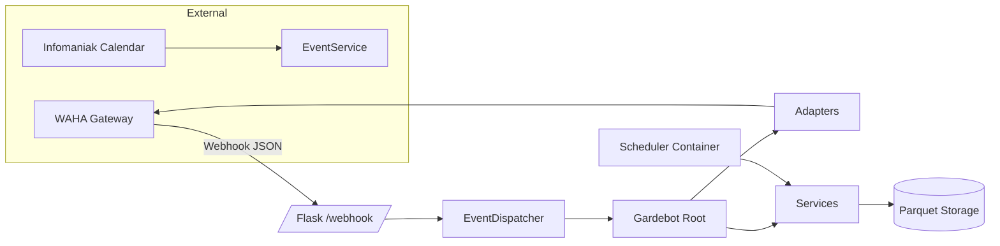
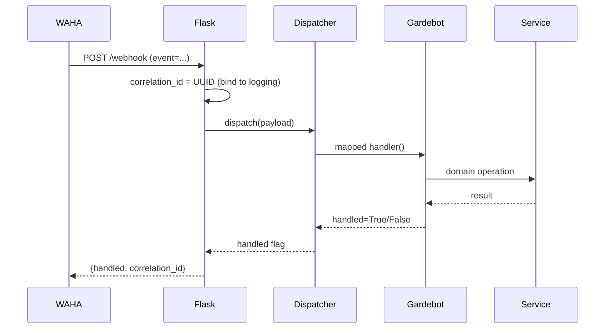
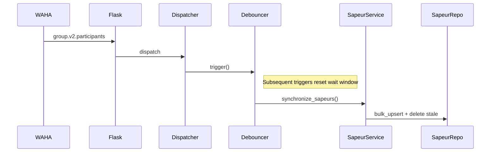

# Gardebot

Gardebot is a Python 3.11 automation service that streamlines WhatsApp-based duty (“garde”) scheduling:

- Pulls future duty events from an Infomaniak Calendar (ICS).
- Publishes availability polls to a WhatsApp group via WAHA (WhatsApp HTTP API).
- Collects Présent / Absent votes and tracks who hasn’t responded.
- Monitors headcount satisfaction (on‑duty assignment saturation).
- Issues day‑before holiday warnings (and scaffolds reminders / escalation for future use).
- Exposes health and Prometheus metrics endpoints for observability.

It is organized around a clear composition root, typed domain models (Pydantic), resilient HTTP abstractions, structured logging with correlation IDs, and atomic Parquet persistence (roadmap: relational DB).

---

## 1. Architecture Overview



### Webhook Processing



### Debounced Participant Sync



---

## 2. Folder Glossary (src/gardebot)

| Path | Purpose |
|------|---------|
| adapters | High-level WAHA interaction wrappers (polling, messaging, groups, contacts). |
| common | Cross-cutting utilities (logging configuration, debounce, storage helpers, secret & formatting helpers). |
| http | Resilient HTTP client with retries, exponential backoff & jitter, structured errors. |
| integrations | External clients (Infomaniak calendar parser; WAHA client using `HttpClient`). |
| models | Pydantic domain objects (Event, Sapeur, VoteRecord, OnDutyAssignment, ParticipationScore, MessageEventEnvelope). |
| services | Orchestrated business logic (event sync, poll publication, vote handling, roster sync, messaging echo, nomination scoring, on‑duty assignment). |
| app.py | Flask app factory (webhook, health, metrics) + correlation ID binding & metrics emission. |
| dispatcher.py | Exact event → handler map; debounced initialization & participant sync triggers. |
| gardebot.py | Composition root constructing adapters & services; entry handlers (initialize, process_vote, message, holiday warning). |
| repositories.py | Atomic Parquet persistence layer for events, sapeurs, votes, and on‑duty matrix (raising `NotFoundError` when missing). |
| scheduler.py | APScheduler cron jobs (event sync, poll publication, holiday warning). |
| settings.py | Typed configuration (server, API, logging, retry/backoff) + secret load. |
| validation.py | Strict message event validation + basic shape check for non‑message events. |

---

## 3. Core Domain Concepts

| Concept | Summary |
|---------|---------|
| Event | Future duty slot with headcount; derives `poll_string`, publication schedule, reminder counters. |
| Poll String | French human-readable composite: title + formatted dates + location; primary logical key for votes/assignments. |
| Sapeur | Participant (uid, name, phone, pushname, joined date). |
| Vote | Availability entry: `Présent`, `Absent`, or null (no response yet). |
| On-Duty Assignment | Collection of sapeurs considered “satisfied” once presence count >= headcount. |
| Nomination | Fallback fairness scoring (non‑responding / absent pools) using participation metrics (roadmap). |

---

## 4. Event Lifecycle

1. Sync: Fetch ICS (future events only), clean rows (drop NA, suffix duplicates), bulk upsert new events.
2. Publication: At or after `scheduled_publication_date` (and not yet assigned/published) send poll to group.
3. Vote Ingestion: `poll.vote` webhook parsed → voter resolved → vote persisted → metrics updated.
4. Headcount Check: Present votes compared to `event.headcount` to decide if assignment condition is satisfied.
5. Reminder (scaffolded): Timing & count logic available; reminders currently disabled until workflow completion.
6. Holiday Warning: Day‑before holiday detection sends proactive admin notification.

---

## 5. Persistence

| File | Role | Notes |
|------|------|-------|
| events.parquet | Event catalog | Bulk upsert only adds new rows (idempotent). |
| sapeurs.parquet | Roster snapshot | Sync inserts new + deletes departed participants. |
| votes.parquet | Wide matrix (rows=sapeur names; cols=poll_string; cells=True/False/NaN) | NaN means no response yet. |
| on_duty.parquet | Wide assignment matrix (True flags presence in assignment) | Used to test satisfaction state. |

Atomic full rewrites ensure consistency; concurrency risks are minimized in single-instance usage. Migration path: relational DB with row-level updates.

---

## 6. Configuration & Secrets

- Centralized in `settings.py` via Pydantic models.
- Environment variables for host/port, WAHA base URL, session, timeouts, retry policy, logging format.
- Secrets (API key, calendar URL, admin number) injected via Doppler or `.env`.
- `POSTPONE_SYNC_TIME` controls debounce window.

---

## 7. Observability

| Metric | Type | Labels | Meaning |
|--------|------|--------|---------|
| gardebot_webhook_events_total | Counter | event, handled | Inbound webhook throughput. |
| gardebot_webhook_errors_total | Counter | event, code | Error occurrences by event & code. |
| gardebot_webhook_latency_seconds | Histogram | event | Processing duration. |
| gardebot_participant_sync_total | Counter | - | Debounced roster sync executions. |
| gardebot_initialize_total | Counter | - | Full initialization runs. |
| gardebot_poll_publish_total | Counter | status | Poll publish success/failure counts. |
| gardebot_vote_processed_total | Counter | result | Vote processing success/errors. |

Correlation ID (UUID) per request for end-to-end log trace.

---

## 8. Scheduler (cron-jobs)

| Time (Europe/Zurich) | Job | Purpose |
|----------------------|-----|---------|
| 02:00 | sync_events | Refresh events from calendar. |
| 09:00 | publish_polls | Publish due polls. |
| 12:00 | warn_holidays | Send admin holiday warning. |

Future: Reminders, escalation, analytics rollups.

---

## 9. Extensibility Playbook

| Goal | Steps |
|------|-------|
| New event type | Add envelope model → register in dispatcher → implement handler → create metrics & docs. |
| New scheduled task | Add function in `scheduler.py` → register cron → instrument metrics. |
| DB migration | Abstract repositories → implement SQL layer → migrate DataFrames to normalized tables. |
| Reminder workflow | Reactivate cron, use `Event.should_send_reminder()` → send targeted mentions (MessagingAdapter). |
| Localization | Externalize French strings; inject via config; toggle language parameter. |
| Fair assignment | Introduce scoring + rotation metadata; decouple poll publication & assignment decision. |

---

## 10. Testing Guidance

| Area | What to Verify |
|------|----------------|
| Webhook | Valid JSON path, correlation ID presence, latency metric recorded. |
| Dispatcher | Exact matching, unhandled event path, debounce correctness (time mocks). |
| Repositories | Upsert semantics, `NotFoundError` behavior, assignment satisfaction logic. |
| Calendar | Duplicate name suffixing, NA row dropping, future-only filtering. |
| Poll Publication | Guard conditions: not due / already assigned / missing poll UID scenarios. |
| Votes | Accepted values & rejection of invalid ones; matrix cell updates. |
| Roster Sync | Insertions + deletions after simulated membership change. |
| Nomination | Score calculation & margin handling (when activated). |
| HTTP | Retry/backoff & error propagation. |
| Logging | Correlation ID cleared post-request (no leakage). |

---

## 11. Roadmap

1. Typed envelopes for all non‑message events.
2. Database persistence (transactional row updates & concurrent safety).
3. Automated reminders + escalation (late responders).
4. Participation analytics & visualization endpoint.
5. Localization (multi‑language polls & messages).
6. Decoupled assignment workflow + admin override UI.
7. Incremental calendar diff ingestion (avoid full rescan).
8. Request signature verification / auth gating (security hardening).
9. Advanced nomination fairness (rotation & fatigue scoring).

---

## 12. Quick Start

```bash
# Install dependencies
poetry install

# Run locally
poetry run python -m gardebot.app

# Or using Docker
docker compose up --build
```

Containers launched:
- waha: WAHA gateway
- gardebot: Flask webhook + core logic
- cron-jobs: Scheduled tasks

Required environment:
- API_KEY (WAHA)
- CALENDAR_URL (Infomaniak ICS)
- ADMIN_NUMBER (international format, for holiday warning convocation)
Optional:
- LOG_LEVEL, LOG_JSON, POSTPONE_SYNC_TIME (debounce tuning)

---

## 13. Operational FAQ

| Symptom | Cause | Action |
|---------|-------|--------|
| No events loaded | Missing/invalid `CALENDAR_URL` | Set secret; trigger initialization or wait for 02:00 sync. |
| Poll not published | Not due / already satisfied | Check `scheduled_publication_date` & `is_assigned()`. |
| Vote ignored | Headcount already met | Confirm assignment state; ignore further votes. |
| Roster stale | Debounce delay or missed sync | Lower `POSTPONE_SYNC_TIME` or force initialize. |
| Metrics empty | Scrape misconfig or endpoint unreachable | Curl `/metrics`; inspect logs/Prometheus setup. |
| Duplicate holiday notices | Incorrect prevention constant | Adjust config (e.g. `PREVENTION_DAY_BEFORE_HOLIDAY`). |

---

## 14. Design Principles

- Clear layering (Adapters → Services → Repositories → Models).
- Deterministic state (atomic parquet writes; planned DB evolution).
- Observability-first (metrics & correlation IDs early).
- Minimal coupling (poll publication conditions separated from vote handling).
- Debounce to reduce noisy participant churn impact.

---

## 15. Portfolio Highlights

When showcasing:
- Typed domain & message envelope boundaries.
- Resilient HTTP with exponential backoff/jitter.
- Structured logging + per-request correlation IDs.
- Separation of scheduled jobs into dedicated container.
- Extensibility roadmap demonstrating forward-thinking architecture.

---

## 16. License & Acknowledgements

See `LICENSE`.

Acknowledgements:
- WAHA project
- Infomaniak (Calendar & Kdrive)
- Doppler (secrets)
- Python OSS community

---

Happy automating! 🚀
