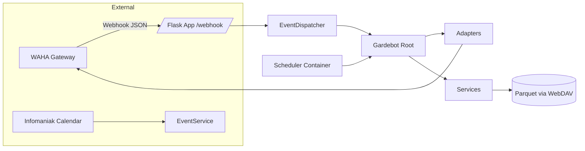
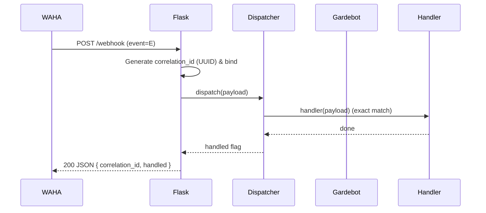
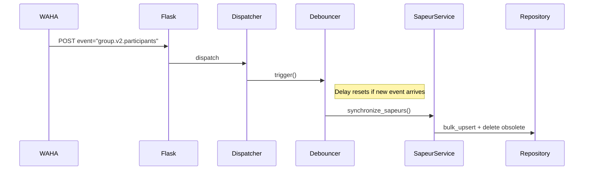

# Gardebot

Gardebot is a Python 3.11 WhatsApp automation service integrating WAHA (WhatsApp HTTP API) and Infomaniak Calendar to organize duty events (“gardes”), collect availability via polls, assign participants (“sapeurs”), and send reminders/convocations.

Recent Refactor Highlights (this PR):
- Exact event dispatch (no substring ambiguity) with debounced participant sync.
- Correlation IDs on each webhook request (traceable across logs).
- Scheduler activation for periodic event synchronization & holiday warnings.
- Calendar parsing fixes (row-based NA dropping, improved duplicate naming).
- Domain `NotFoundError` replacing generic `ValueError` in repositories.
- Expanded Prometheus metrics (initialize, poll publish, vote processed).
- Reduced service duplication via shared composition root (Gardebot).
- Refined on-duty assignment logic: satisfaction based on headcount.
- Cleaner logging bootstrap (single configuration point).

---

## Architecture Overview



### Request Lifecycle (Webhook)



### Debounced Participant Sync



---

## Components

| Layer | Modules | Notes |
|-------|---------|-------|
| Web | `app.py` | Correlation IDs, validation, metrics endpoint |
| Dispatch | `dispatcher.py` | Exact event map, debounced initialize & participants |
| Root | `gardebot.py` | Shared adapters + services, initialization instrumentation |
| Adapters | `adapters/*.py` | WAHA operations (messaging, polling, groups, contacts) |
| Services | `services/*.py` | Domain logic (events, votes, sapeurs, on-duty, nomination, messages) |
| Integrations | `integrations/*.py` | WAHA client + Infomaniak calendar parsing |
| Persistence | `repositories.py`, `common/storage.py` | Parquet over WebDAV (atomic write) |
| Models | `models/domain.py`, `models/message_event.py` | Pydantic domain entities |
| Observability | `metrics.py`, logging config | Prometheus counters/histograms, structlog |
| Scheduling | `scheduler.py` | Cron jobs (sync events, holiday warnings) |

---

## Event Types (Current)

| Event Name | Handler | Purpose |
|------------|---------|---------|
| `message` | `Gardebot.handle_incoming_message` | Command/echo handling |
| `poll.vote` | `Gardebot.process_vote` (→ PollingAdapter) | Availability voting |
| `session.status` | Debounced `Gardebot.initialize` | Re-initialize on WORKING status |
| `group.v2.participants` | Debounced `Gardebot.update_sapeurs` | Sync roster after membership changes |

---

## Metrics

| Metric | Type | Labels | Description |
|--------|------|--------|-------------|
| `gardebot_webhook_events_total` | Counter | event, handled | Webhook events processed |
| `gardebot_webhook_errors_total` | Counter | event, code | Error occurrences |
| `gardebot_webhook_latency_seconds` | Histogram | event | Webhook handling latency |
| `gardebot_participant_sync_total` | Counter | - | Participant sync executions |
| `gardebot_initialize_total` | Counter | - | Initialization runs |
| `gardebot_poll_publish_total` | Counter | status | Poll publish success/failure |
| `gardebot_vote_processed_total` | Counter | result | Vote processing success/error |

---

## Persistence Model

| File | Description | Repository |
|------|-------------|------------|
| `events.parquet` | Duty events (title, dates, headcount, poll metadata) | EventRepository |
| `sapeurs.parquet` | Participant roster snapshot | SapeurRepository |
| `votes.parquet` | Vote matrix (index=sapeur, columns=poll_string) | VoteRepository |
| `on_duty.parquet` | Assignment matrix (index=sapeur, columns=poll_string) | OnDutyRepository |

Limitation: Full DataFrame rewrite per mutation (future: normalized schema + DB backend).

---

## Configuration & Secrets

- Typed settings: `settings.py` (server, api, logging, debounce).
- Legacy constants: `config.py` (to be unified).
- Secrets: via Doppler (`API_KEY`, `DOPPLER_TOKEN`, Kdrive credentials, calendar URL).
- Correlation IDs bound via logging context for traceable diagnostics.

---

## Scheduler

Activated in `cron-jobs` container:
- `sync_events`: Daily calendar sync at 02:00 (Europe/Zurich).
- `warn_holidays`: Holiday warning dispatch at 12:00.

Extend with poll publication & reminder jobs in future iteration.

---

## Validation & Error Handling

- Typed message event validated (`MessageEventEnvelope`).
- Other events: minimal presence check (roadmap: typed envelopes).
- Domain errors: `GardebotError`, `ExternalServiceError`, `ValidationError`, `NotFoundError`.
- Repositories now raise `NotFoundError` for missing resources.

---

## Correlation IDs

Each webhook request generates a UUID (`correlation_id`) included in responses and bound to the logging context for end-to-end traceability.

---

## Extensibility Guidelines

1. Add new event:
   - Define envelope (Pydantic).
   - Register in dispatcher map.
   - Implement handler on Gardebot or service.
   - Add metric and README entry.

2. Extend scheduler:
   - Add function in `scheduler.py`.
   - Configure cron expression.
   - Instrument with `record_event`.

3. Migrate persistence:
   - Introduce row-based schema (poll_string, sapeur_uid, timestamp).
   - Transition writes to SQLite/Postgres.

4. Localization:
   - Externalize French messages into resource files (planned).

---

## Testing (Recommended Coverage)

| Area | Tests |
|------|-------|
| Dispatcher | Exact match success/failure, debounce timing |
| Webhook | Correlation ID presence, invalid JSON, invalid event |
| Repositories | NotFoundError raises, headcount assignment logic |
| Calendar | Duplicate naming, NA row removal |
| Metrics | Counters increment on publish/vote/initialize |
| Scheduler | Job execution smoke tests (time mocking) |
| Voting | Success path + missing poll_id / missing voter_id |
| Sapeur Sync | Insert + delete with single fetch |

---

## Known Limitations / Technical Debt

| Topic | Limitation | Planned |
|-------|------------|---------|
| Event validation | Only message typed | Typed envelopes for all events |
| Persistence | Parquet rewrite, race risk | Introduce DB backend |
| Admin vote | Not implemented | Add admin-specific logic |
| Assignment logic | Publication vs assignment coupling | Separation & analytics |

---

## Quick Start

```bash
make
poetry run python -m gardebot.app
docker compose up --build
```

---

## Troubleshooting

| Symptom | Possible Cause | Fix |
|---------|----------------|-----|
| Missing correlation_id | Old code path or misconfigured route | Redeploy updated image |
| Poll not publishing | Not yet due / already assigned | Check `scheduled_publication_date` & assignment |
| Vote ignored | Poll already fully assigned | Verify OnDuty headcount satisfaction |
| Empty events | Calendar URL unset | Set `CALENDAR_URL` or Doppler secret |
| Participant sync delays | Debounce window | Adjust `POSTPONE_SYNC_TIME` env |

---

## Roadmap

1. Typed envelopes for all event types.
2. DB-backed persistence (transactional, scalable).
3. Reminder & escalation workflows (automated).
4. Participation analytics endpoint.
5. Localization & multi-language poll strings.

---

## License

See `LICENSE`.

---

## Acknowledgements

- CookieBlueprint scaffold
- WAHA project
- Infomaniak (Calendar & Kdrive)
- Doppler
- Python OSS community

---

Happy automating! 🚀
